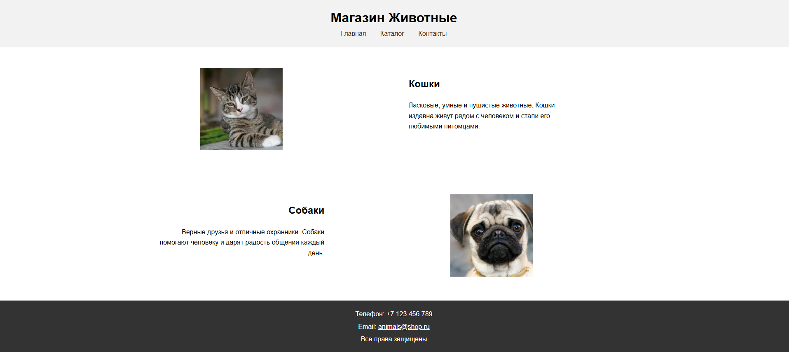

# Модуль 2. Урок 5. Семантическая разметка (header, nav, main, article, section, footer). Расширенные селекторы, наследование. Базовое выравнивание.

---

## 1. Введение: что такое **семантика** и почему она важна

Когда мы писали первые страницы, мы часто использовали только `<div>` для построения структуры. Но у такого подхода есть минусы: страница становится «безликой» для поисковых систем и вспомогательных технологий (например, экранных читалок для людей с нарушениями зрения).

**Семантика** — это когда каждый тег имеет _смысл_ и отражает предназначение содержимого.
Например:

- `<header>` — «шапка» сайта, обычно название или логотип + навигация.
- `<nav>` — раздел навигации, где располагаются ссылки.
- `<main>` — основное содержимое страницы.
- `<section>` — отдельный смысловой блок внутри `main`.
- `<article>` — самостоятельный кусок контента (новость, блог-пост, товар).
- `<footer>` — нижняя часть страницы, контакты, копирайты.

Зачем это нужно?

- **SEO (поисковая оптимизация):** поисковики понимают, где важный контент.
- **Доступность:** экранные читалки могут быстро перемещаться между `header`, `nav`, `main`, `footer`.
- **Поддержка и читаемость кода:** программисту проще читать структуру страницы.

Таким образом, семантика — это не только про «красивые» теги, а про удобство для пользователей и разработчиков.

---

## 2. Переход от `div` к семантическим тегам: до / после

Когда мы не знали про семантику, мы могли написать так:

```html
<div class="header">
  <h1>Название сайта</h1>
  <div class="nav">
    <a href="#">Главная</a>
    <a href="#">О нас</a>
    <a href="#">Контакты</a>
  </div>
</div>

<div class="main">
  <div class="article">
    <h2>Заголовок статьи</h2>
    <p>Текст статьи...</p>
  </div>
</div>

<div class="footer">
  <p>Все права защищены © 2025</p>
</div>
```

А теперь — то же самое, но «по-правильному»:

```html
<header>
  <h1>Название сайта</h1>
  <nav>
    <a href="#">Главная</a>
    <a href="#">О нас</a>
    <a href="#">Контакты</a>
  </nav>
</header>

<main>
  <article>
    <h2>Заголовок статьи</h2>
    <p>Текст статьи...</p>
  </article>
</main>

<footer>
  <p>Все права защищены © 2025</p>
</footer>
```

Оба варианта выглядят одинаково в браузере, но второй лучше понимается поисковиками и людьми.

---

## 3. Структура страницы: основные теги

Разберём по частям:

- **`<header>`** — используется для шапки сайта. Внутри часто `h1` (название сайта) и `nav`.
- **`<nav>`** — навигация (ссылки на разделы сайта).
- **`<main>`** — основной контент страницы.
- **`<section>`** — логический раздел. Например, «Новости», «Отзывы», «Популярные товары».
- **`<article>`** — отдельный материал (новость, блог-пост, товар, карточка). Может существовать автономно.
- **`<footer>`** — нижний блок страницы. Обычно там контакты, копирайт, ссылки на соцсети.

---

## 4. Практика: собираем мини-шаблон HTML

Теперь шаг за шагом создадим простую страницу.

---

### Шаг 1. Шапка сайта (header + nav)

1. Создайте тег `<header>`.
2. Внутри него сделайте `<h1>` с названием сайта (например, «Мой сайт»).
3. Под названием создайте блок `<nav>`.
4. Внутри `<nav>` сделайте 3 ссылки (`<a>`): «Главная», «О нас», «Контакты».

---

### Шаг 2. Основная часть (main + article)

1. После `header` создайте тег `<main>`.
2. Внутри него создайте два блока `<article>`.
3. В каждом `<article>` добавьте:

   - заголовок `<h2>` (например, «Первая статья»);
   - абзац `<p>` с любым текстом (можно использовать lorem ipsum).

---

### Шаг 3. Разделение на секции

1. Оберните оба `<article>` в один `<section>`.
2. Для наглядности можно подписать этот раздел с помощью `<h2>` перед статьями (например, «Новости»).

---

### Шаг 4. Подвал сайта (footer)

1. После `main` добавьте `<footer>`.
2. Внутри напишите: «Все права защищены © 2025».
3. Добавьте телефон и email (например, `<p>Тел: +7 (999) 123-45-67</p>`).

---

## 5. Расширенные селекторы в CSS — подробный разбор

**Коротко:** расширенные селекторы позволяют выбирать элементы не только по их имени, классу или id, но и **в зависимости от их положения в структуре документа** — «вложенность», «соседи», а также объединять несколько селекторов в одно правило. Это даёт гибкость и точность при стилизации.

---

### 5.1. Селектор потомков (descendant selector) — `A B`

**Синтаксис:** `A B { /* стили */ }`
**Что выбирает:** все элементы `B`, которые находятся внутри (вложены в) элемент `A` на любом уровне глубины (не обязательно прямой ребёнок).

**Пример:**

```css
main div {
  background: #fff8e1;
}
```

Это правило применится ко всем `div`, которые где-нибудь внутри `main` — будь то прямые дети, внуки или глубже.

**Когда использовать:** когда вам нужно применить стиль ко всем элементам данного типа внутри определённой области страницы, вне зависимости от глубины (например, все параграфы в `.article`, или все изображения в `main`).

**Замечание:** будьте аккуратны — descendant-селектор может захватить больше элементов, чем вы ожидаете, если структура гибкая. Если нужен только прямой ребёнок — используйте `>` (см. ниже).

---

### 5.2. Дочерний селектор (child) — `A > B`

**Синтаксис:** `A > B { /* стили */ }`
**Что выбирает:** только те `B`, которые являются **прямыми** детьми `A` (т.е. уровень вложенности ровно один).

**Пример:**

```css
main > article {
  margin-bottom: 24px;
}
```

Это правило применится только к `article`, которые расположены непосредственно внутри `main`. Если `article` вложен глубже (например, внутри `section`), правило не сработает.

**Когда использовать:** когда вам нужно быть точным и не затрагивать более глубокие уровни вложенности — например, стили для первичных разделов страницы, но не для внутренних блоков в статьях.

---

### 5.3. Соседний селектор (adjacent sibling) — `A + B`

**Синтаксис:** `A + B { /* стили */ }`
**Что выбирает:** элемент `B`, который **непосредственно следует** в документе за элементом `A` и находится на том же уровне вложенности (т.е. «сосед справа»).

**Пример:**

```css
h2 + p {
  margin-top: 8px;
  color: #333;
}
```

Это правило применится только к `p`, который идёт **сразу после** `h2` (в том же родительском контейнере). Если между ними есть ещё элемент, правило не сработает.

**Когда использовать:** удобно, чтобы «сбросить» или настроить отступ у параграфа, который непосредственно идёт после заголовка (типичный паттерн: заголовок + первый абзац).

---

### 5.4. Общий сосед (general sibling) — `A ~ B`

**Синтаксис:** `A ~ B { /* стили */ }`
**Что выбирает:** все элементы `B`, которые идут после `A` и имеют того же родителя (то есть «все следующие соседи»). Не обязательно прямые.

**Пример:**

```css
h2 ~ p {
  color: #666;
}
```

Это правило применится ко всем `p` после `h2` в рамках одного родителя.

**Когда использовать:** когда хотите, чтобы несколько последующих элементов наследовали одно правило, если они находятся после определённого ориентирующего элемента.

---

### 5.5. Группировка селекторов — `A, B, C`

**Синтаксис:** `selector1, selector2 { /* общие стили */ }`
**Что делает:** позволяет записать одно правило, которое применяется к разным селекторам — экономит код и делает его чище.

**Пример:**

```css
h1,
h2,
h3 {
  font-family: "Arial", sans-serif;
  color: #222;
}
```

**Когда использовать:** когда нужно задать один и тот же набор свойств для нескольких типов элементов.

---

### 5.6. Селекторы атрибутов — `A[атрибут="значение"]`

**Синтаксис:** `a[target="_blank"] { /* стили */ }`
**Что выбирает:** элементы, у которых в HTML задан указанный атрибут с соответствующим значением. Можно задавать разные варианты — наличие атрибута вообще, частичное совпадение и т.д. (есть несколько форм записи: `[attr]`, `[attr="value"]`, `[attr^="start"]`, `[attr$="end"]`, `[attr*="contains"]`).

**Пример (конкретный):**

```css
a[target="_blank"] {
  color: #c00;
  text-decoration: underline;
}
```

Это правило применится ко всем ссылкам, которые открываются в новой вкладке (`target="_blank"`).

**Когда использовать:** удобно для стилизации ссылок по их поведению (например, внешние ссылки), полей форм по наличию атрибута и т.д.

---

### Короткое резюме по селекторам

- `A B` — любой потомок `B` внутри `A` (вне зависимости от уровня).
- `A > B` — прямой ребёнок `B` у `A`.
- `A + B` — `B` сразу после `A` (смежный сосед).
- `A ~ B` — все `B` после `A` на том же уровне.
- Группировка объединяет правила для нескольких селекторов.
- Селекторы атрибутов позволяют выбирать элементы по наличию/значению атрибутов.

Во многих задачах комбинация этих селекторов даёт точечную и при этом выразительную стилизацию.

---

## 6. Наследование CSS — что наследуется и зачем это удобно

**Идея наследования:** некоторые CSS-свойства по умолчанию **наследуются** от родителя к потомку. Это значит: если вы задали их у родительского элемента, дочерние автоматически возьмут это значение, если у них не задано своё. Это очень удобно — уменьшает повторяемость кода.

### 6.1. Какие свойства обычно наследуются

Часто наследуемые свойства (основные):

- `color` — цвет текста
- `font-family` — семейство шрифтов
- `font-size` — размер шрифта (иногда)
- `font-style`, `font-weight`
- `line-height` — междустрочный интервал
- `text-align` — выравнивание текста (в некоторых случаях)
- `visibility`
- `direction`

**Пример:**

```css
body {
  color: #222;
  font-family: Arial, sans-serif;
}

main p {
  /* не задаём color — он наследуется от body и будет #222 */
}
```

Задав `color` и `font-family` в `body`, вы обеспечили единообразный текстовый стиль по всей странице.

### 6.2. Какие свойства НЕ наследуются

Чаще всего НЕ наследуются:

- `margin`, `padding`
- `border`
- `background` (background-color, background-image)
- `width`, `height`
- `display`, `position`
- `float`, `clear`

**Почему:** эти свойства определяют **физическую коробку** элемента (box), и логично, что дочерние элементы имеют свои собственные размеры/отступы/фоны.

### 6.3. Практический пример: наследование и переопределение

HTML:

```html
<body>
  <main>
    <article>
      <h2>Заголовок</h2>
      <p>Первый абзац — будет унаследован цвет.</p>
      <p class="special">В этом абзаце цвет переопределён.</p>
    </article>
  </main>
</body>
```

CSS:

```css
body {
  color: #333;
  font-family: Arial, sans-serif;
}

.special {
  color: #a00;
} /* переопределяет унаследованный цвет */
```

Пояснение: оба параграфа по умолчанию получат `color: #333`, но у `.special` явно задан другой цвет — он переопределит унаследованный.

### 6.4. Ключевые слова: `inherit`, `initial`, `unset`

- `inherit` — принудительно унаследовать значение от родителя: `p { color: inherit; }`
- `initial` — сбросить к браузерному значению по умолчанию.
- `unset` — ведёт себя как `inherit`, если свойство наследуемо, или как `initial`, если не наследуемо.

Используются редко на базовом уровне, но полезны в отдельных случаях (например, сброс стилей).

---

## 7. Специфичность и каскад (в двух словах)

Когда одно и то же свойство задано несколькими правилами, браузер выбирает, какое именно правило применять, руководствуясь **кассадом (Cascading)** и **специфичностью**.

### 7.1. Порядок применения (упрощённо)

1. **Важно (!important):** правила с `!important` имеют наивысший приоритет (но их использование не рекомендуется без крайней необходимости).
2. **Специфичность:** чем «точнее» селектор, тем выше приоритет.
3. **Источник и порядок:** если специфичность одинаковая — побеждает правило, которое идёт ниже в CSS (последнее объявленное).

### 7.2. Как считается специфичность (упрощённая шкала)

- inline-стили (`style="..."`) — самая высокая «специфичность» (примерно 1000 в условной системе).
- селектор `id` (`#id`) — большой вес (примерно 100).
- селектор класса, атрибута, псевдокласса (`.class`, `[attr]`, `:hover`) — средний вес (примерно 10).
- селектор тега/псевдоэлемента (`h1`, `p`, `::before`) — низкий вес (примерно 1).

**Примеры:**

- `p { color: red; }` — специфичность 1
- `.intro p { color: blue; }` — специфичность 10 + 1 = 11
- `#main .intro p { color: green; }` — специфичность 100 + 10 + 1 = 111

Если два правила конфликтуют, браузер выберет правило с большей специфичностью. Если специфичности равны — правило, указанное позже, побеждает.

### 7.3. Практический пример конфликта

CSS:

```css
p {
  color: red;
} /* низкая специфичность */
.intro p {
  color: blue;
} /* выше */
#main p {
  color: green;
} /* ещё выше */
```

Если элемент `<p>` находится внутри `#main` и `.intro`, применится `color: green` (потому что `#main p` более специфичен).

### 7.4. Когда применять что

- Используйте селекторы тегов для глобальных, базовых правил.
- Используйте классы для повторного стиля элементов (лучше, чем id).
- ID — только для уникальных случаев (и осторожно, т.к. повышает специфичность).
- Не злоупотребляйте `!important`.

---

## 8. Стилизация семантической разметки с помощью расширенных селекторов — практические примеры

Теперь — объединяем всё: **семантика + расширенные селекторы + наследование + специфичность**. Ниже — набор полезных примеров (взяты из шаблона, который ранее собирали).

### Пример базовой разметки (напоминаем)

```html
<header>
  <h1>Мой сайт</h1>
  <nav>
    <a href="#">Главная</a>
    <a href="#">Блог</a>
    <a href="#">Контакты</a>
  </nav>
</header>

<main>
  <section>
    <article>
      <h2>Первая статья</h2>
      <p>Немного текста...</p>
    </article>

    <article>
      <h2>Вторая статья</h2>
      <p>Ещё немного текста...</p>
    </article>
  </section>
</main>

<footer>
  <p>Контакты: info@example.com</p>
</footer>
```

### Пример CSS с расширенными селекторами и пояснениями

```css
/* 1. Базовые глобальные стили (наследуются) */
body {
  font-family: Arial, sans-serif;
  color: #222; /* наследуется потомками */
  line-height: 1.5;
}

/* 2. Стили для header — семантический селектор */
header {
  background-color: #2b6cb0;
  color: white;
  padding: 20px 0;
  text-align: center;
}

/* 3. Навигация: все ссылки внутри header nav — descendant */
header nav a {
  display: inline-block; /* ставим в строку */
  margin: 0 12px; /* отступы между пунктами */
  color: white; /* наследовать не нужно — явно задаём */
  text-decoration: none;
}

/* 4. Секция статей: стили для section внутри main — child selector */
main > section {
  background: #f8f8f8;
  padding: 20px;
}

/* 5. Стили для Article: только прямые article в main (child selector) */
main > section > article {
  display: inline-block; /* выстроить статьи в ряд */
  width: 48%;
  vertical-align: top;
  background: white;
  border: 1px solid #ddd;
  padding: 15px;
  margin: 1%;
  box-sizing: border-box; /* чтобы padding не ломал ширину */
}

/* 6. Заголовок статьи и параграф: соседний селектор h2 + p */
main article h2 + p {
  margin-top: 8px;
  color: #444;
}

/* 7. Селектор атрибута: ссылки, открывающие в новой вкладке */
a[target="_blank"] {
  color: #c00;
}

/* 8. footer */
footer {
  background: #f2f2f2;
  text-align: center;
  padding: 15px;
  color: #333;
}

/* 9. Пример комбинирования селекторов (класс + тег) */
aside .note p {
  font-size: 14px;
  color: #666;
}
```

### Пояснения и советы по этому CSS

- `body` даёт базовый `color` и `font-family`, которые **наследуются** всеми текстовыми элементами — это экономит запись и даёт единый стиль.
- `header nav a` — descendant-селектор: выбираем **все** ссылки внутри `nav` внутри `header`. Здесь удобно задать `display:inline-block` для пунктов меню и расстояние `margin` между ними.
- `main > section` и `main > section > article` — child-селекторы: мы чётко ограничиваем область влияния правил только прямыми детьми, что защищает нас от нежелательных попаданий.
- `h2 + p` — «первый» параграф после заголовка: часто нужен для настройки отступа сразу после заголовка.
- `a[target="_blank"]` — пример селектора атрибутов: полезно помечать внешний или открывающийся в новой вкладке ссылки.

---

## Небольшие практические задания

1. В HTML-шаблоне добавьте в `nav` ссылку с `target="_blank"`. В CSS сделайте её цвет красным через селектор атрибута `a[target="_blank"]`.
2. Задайте в `body` `color: #333` и убедитесь, что все `p` получили этот цвет без явного указания. Затем у одного `p` задайте `.special { color: #c00; }` — проверьте переопределение.
3. Попробуйте `main > section > article { width: 48%; }` и посмотрите, как `display:inline-block` выстраивает статьи в две колонки.
4. Добавьте `h2 + p { font-weight: bold; }` и проверьте, что только первый абзац после каждого `h2` становится жирным.

---

## Практика "Семантическая разметка + расширенные селекторы, наследование"

### Практика 1. Семантическая разметка

**Цель:** перейти от `div`-разметки к семантической.

1. Создайте простую структуру страницы с помощью только `<div>`:

   - верхний блок для шапки,
   - средний блок для основного контента,
   - нижний блок для подвала.

2. Теперь замените `div` на семантические теги:

   - `<header>`, `<main>`, `<footer>`.

3. В `<header>` добавьте название сайта (`<h1>`) и три ссылки на разделы (например: Главная, Новости, Контакты).

4. В `<main>` создайте два материала (`<article>`), внутри каждого должен быть заголовок `<h2>` и текст.

5. В `<footer>` укажите контакты: email и телефон.

---

### Практика 2. Структура страницы с вложенностью

**Цель:** тренировка вложенности и разделения на секции.

1. Внутри `<main>` создайте два `<section>`.

2. В первой секции разместите один `<article>` с заголовком и текстом.

3. Во второй секции разместите два `<article>`:

   - первый с картинкой и подписью,
   - второй с коротким текстом и ссылкой «Читать далее».

4. Проверьте, что секции и статьи вложены правильно.

---

### Практика 3. Селекторы: от простых к расширенным

**Цель:** закрепить разные виды селекторов.

1. Создайте CSS-правило для всех заголовков (`h1, h2, h3`), чтобы у них был общий цвет.
2. Сделайте правило для всех `<article>`, которые лежат прямо внутри `<main>` (используйте дочерний селектор). Установите им рамку.
3. Добавьте правило для всех параграфов, которые идут сразу после заголовка `<h2>` (соседний селектор). Например, выделите их другим цветом текста.
4. Сделайте правило для всех параграфов, которые находятся **после** заголовка `<h2>` в пределах статьи (общий сосед). Пусть они будут чуть меньше по размеру шрифта.
5. Добавьте правило для ссылок внутри навигации (`nav a`) — сделайте их одинакового стиля (например, серый цвет и отступы).
6. Добавьте стиль для ссылок с атрибутом `target="_blank"`, например сделайте их другим цветом.

---

### Практика 4. Наследование и каскад

**Цель:** понять, как стили передаются и что переопределяется.

1. Задайте для всего документа (`body`) базовый цвет текста и шрифт. Проверьте, что все элементы унаследовали эти свойства.
2. Сделайте стиль для `<footer>` с серым текстом. Внутри `<footer>` задайте для ссылок другой цвет — проверьте, что они не унаследовали цвет родителя.
3. Добавьте общий стиль для всех параграфов (`p`), например — выравнивание по ширине.
4. Добавьте специальный класс `.note`, который переопределит цвет текста параграфа. Примените его к одному из параграфов.
5. Создайте конфликтное правило:

   - `article p {}` — зелёный текст,
   - `#special p {}` — синий текст.
     Проверьте, что у статьи с `id="special"` текст действительно синий (работает приоритет id).

---

### Итоговое задание (мини-проект)

Соберите полноценную страницу:

1. Шапка (`header`) с названием сайта и навигацией.
2. Основная часть (`main`) с двумя секциями:

   - первая содержит статью с текстом и картинкой;
   - вторая содержит статью с заголовком, текстом и ссылкой «Подробнее».

3. Подвал (`footer`) с контактами.
4. В CSS:

   - общий шрифт и цвет текста через `body`,
   - общий стиль для заголовков,
   - отдельный стиль для ссылок внутри навигации,
   - разные цвета для секций через селектор дочерних элементов (`main > section`),
   - выделение первого параграфа после заголовка `<h2>` особым стилем (`h2 + p`).

---

## 9. Базовое выравнивание элементов (без flex/grid)

Когда ещё не было **flexbox** и **grid**, все выравнивание на веб-страницах строилось на свойствах `display`, `text-align`, `margin` и `float`. Эти техники до сих пор полезны — во-первых, для понимания истории верстки, во-вторых, потому что встречаются в старых проектах.

---

### 1. Центрирование текста и строчных элементов

Самый простой способ: использовать свойство **`text-align`** у родителя.

```html
<div class="wrapper">
  <a href="#">Ссылка 1</a>
  <a href="#">Ссылка 2</a>
  <a href="#">Ссылка 3</a>
</div>
```

```css
.wrapper {
  text-align: center; /* всё содержимое по центру */
}
.wrapper a {
  display: inline-block; /* чтобы ссылкам можно было задавать размеры */
  padding: 10px;
  background-color: lightblue;
}
```

> Все элементы `<a>` стали в строку и выровнялись по центру, потому что родительский `div` применил `text-align: center`.

---

### 2. Центрирование блока по горизонтали

Если элемент `display: block`, то он занимает всю ширину строки. Чтобы центрировать **сам блок**, нужно:

- задать ему фиксированную ширину,
- применить `margin: 0 auto`.

```html
<div class="box">Я по центру!</div>
```

```css
.box {
  width: 300px;
  background-color: lightgreen;
  margin: 0 auto; /* автоматически одинаковые отступы слева и справа */
  padding: 20px;
}
```

✅ Теперь блок фиксированной ширины аккуратно встал по центру страницы.

---

### 3. Горизонтальное меню

Классический пример использования `inline-block`.

```html
<nav class="menu">
  <a href="#">Главная</a>
  <a href="#">Новости</a>
  <a href="#">Контакты</a>
</nav>
```

```css
.menu {
  text-align: center; /* выравниваем меню целиком */
}
.menu a {
  display: inline-block; /* превращаем ссылки в блочные элементы внутри строки */
  padding: 10px 20px;
  background-color: lightcoral;
  margin: 5px;
  text-decoration: none;
  color: white;
}
```

> Получилось горизонтальное меню по центру, где каждая ссылка выглядит как кнопка.

---

### 4. Колонки с помощью `inline-block`

До появления flex/grid колонки часто делали именно так.

```html
<div class="column">Колонка 1</div>
<div class="column">Колонка 2</div>
<div class="column">Колонка 3</div>
```

```css
.column {
  display: inline-block; /* элементы встают в одну линию */
  width: 30%; /* фиксируем ширину каждой колонки */
  margin: 1%;
  background-color: lightyellow;
  text-align: center;
}
```

> Три колонки стоят в ряд и автоматически переносятся на новую строку, если ширины экрана не хватает.

---

### 5. Колонки с помощью `float`

Другой классический способ — использование **float**.

```html
<div class="column">Колонка 1</div>
<div class="column">Колонка 2</div>
<div class="column">Колонка 3</div>
<div class="footer">Подвал</div>
```

```css
.column {
  float: left; /* все колонки выравниваются слева */
  width: 30%;
  margin: 1%;
  background-color: lightpink;
  text-align: center;
}
.footer {
  clear: both; /* подвал всегда ниже колонок */
  background-color: lightgray;
  padding: 20px;
  text-align: center;
}
```

> Колонки прижались в ряд слева, а `clear: both` у подвала гарантирует, что он не «поднимется» рядом с ними.

---

### 6. Различия подходов

- `text-align + inline-block`
  — удобен для центрирования и меню, но есть пробелы между элементами (между `inline-block` всегда есть «щель» от пробела в HTML).

- `margin: 0 auto`
  — подходит только для центрирования **блочного** элемента с фиксированной шириной.

- `inline-block` для колонок
  — просто, работает без дополнительных костылей, но требует внимательности к пробелам между элементами.

- `float`
  — универсален, позволяет строить сложные сетки, но ломает поток документа (после плавающих элементов нужно «очищать» обтекание с помощью `clear`).

---

# 10. Практика

## 1. Базовая структура страницы

- Создайте HTML-документ.
- Добавьте в него три основные части:

  - `header` (шапка сайта).
  - `main` (основное содержимое).
  - `footer` (подвал сайта).

- Подключите CSS-файл для стилизации.

---

## 2. Шапка сайта (`header`)

### Шаг 1. Название магазина

- Внутри `header` создайте **заголовок первого уровня** (название сайта).
- Впишите, например: «Животные».
- Сделайте так, чтобы заголовок находился **по центру страницы**.

  - Для этого используйте приём выравнивания текста по центру.

### Шаг 2. Навигация

- Под заголовком разместите **навигацию с помощью ссылок**.
- 3 ссылки подряд (например: «Главная», «Каталог», «Контакты»).
- Ссылки должны стоять в **одной строке**.
- Между ссылками добавьте небольшие промежутки (через внешние отступы или внутренние отступы).
- Выровняйте всю навигацию **по центру**.

---

## 3. Основной контент (`main`)

В `main` сделаем **две секции**, каждая будет представлять маленький блок информации о животных.

### Секция 1 (Фото слева, текст справа)

- Создайте первую `section`.
- Внутри разместите:

  1. Слева — картинку (например, фото кота или собаки).
  2. Справа — заголовок второго уровня (например: «Кошки») и текст-описание (несколько предложений про кошек: «Ласковые, умные, пушистые»).

- Чтобы картинка была слева, а текст справа:

  - используйте либо `display: inline-block`, либо `float` для картинки.
  - ширину изображения сделайте примерно 200px, чтобы оно не было слишком большим.

### Секция 2 (Текст слева, фото справа)

- Создайте вторую `section`.
- Здесь сделаем наоборот:

  1. Слева — заголовок второго уровня (например: «Собаки») и описание (несколько предложений про собак: «Верные друзья, отличные охранники»).
  2. Справа — фото собаки.

- Выравнивание сделайте так же, но поменяйте местами блоки.

> Важно: обратите внимание, чтобы секции не «налипали» друг на друга — добавьте внешние отступы сверху и снизу.

---

## 4. Подвал сайта (`footer`)

Внизу страницы сделаем три строчки с контактами и копирайтом.

- Первая строка: телефон магазина (например: «Телефон: +7 123 456 789»).
- Вторая строка: email (например: «Email: [animals@shop.ru](mailto:animals@shop.ru)»).
- Третья строка: текст «Все права защищены».
- Сделайте так, чтобы все три строки были **по центру**.
- Добавьте небольшой внутренний отступ сверху и снизу, чтобы текст не прилипал к границам страницы.
- Цвет фона подвала можно сделать тёмно-серым или светло-серым, а текст — белым или чёрным для контраста.

---

## 5. Стилизация и оформление

- Для всего документа установите приятный шрифт (например, семейство без засечек).
- Сделайте небольшой фон для `header` и `footer`, чтобы они выделялись.
- Добавьте отступы к заголовкам и тексту внутри `main`, чтобы страница выглядела аккуратной.
- Убедитесь, что изображения и текст в секциях выровнены по вертикали (например, через `vertical-align: top`).

---

## Пример страницы, которая должна получиться:



# Вопросы

---

# Домашняя работа

---

[Предыдущий урок](lesson04.md) | [Следующий урок](lesson06.md)