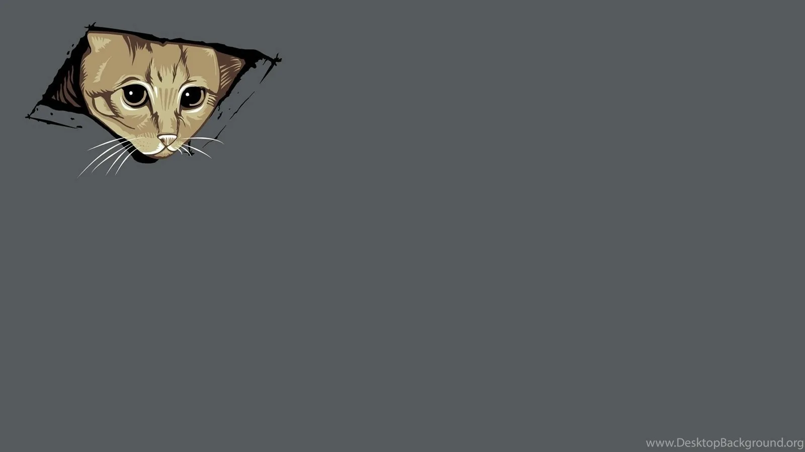
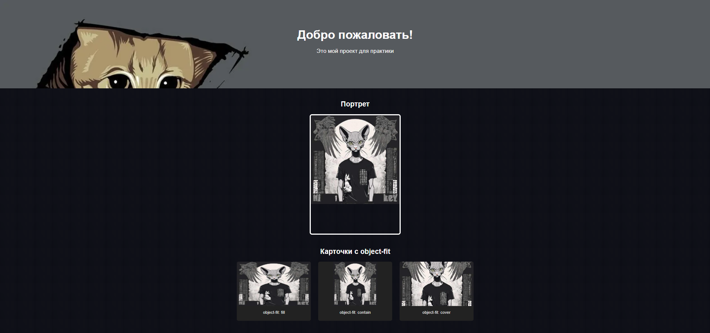

# Модуль 2. Урок 7. Работа с изображениями и фоном (img, background). Стилизация background с помощью изображений и/или градиента.


---

## `` и его атрибуты — что и почему

### Атрибут `src` — источник изображения

Самый главный атрибут. В него мы указываем путь к файлу изображения (локальный или внешний URL).

```html

```

Без `src` картинка просто не появится.

---

### Атрибут `alt` — альтернативный текст

Один из самых важных атрибутов. Он выполняет сразу несколько функций:

1. **Доступность**: скринридеры озвучивают содержимое `alt` для людей с нарушением зрения.
2. **SEO**: поисковые системы используют `alt`, чтобы понять, что изображено на картинке.
3. **Fallback**: если картинка не загрузится (ошибка, медленный интернет), вместо неё будет показан текст из `alt`.

**Когда писать пустой `alt=""`:**

- Если картинка чисто декоративная и не несёт смысловой нагрузки (например, иконка или фоновый узор).
  В этом случае пустой `alt` говорит скринридеру: «Игнорируй это изображение».

**Когда писать осмысленный `alt`:**

- Если картинка важна для понимания контента (фото товара, схема, иллюстрация в статье).

Пример:

```html
<!-- Картинка имеет смысл, alt обязателен -->


<!-- Декоративная картинка, alt пустой -->

```

---

### Атрибуты `width` и `height` — размеры изображения

Раньше считалось, что размеры можно указывать только через CSS. Но сегодня есть другая практика: **атрибуты `width` и `height` должны быть заданы прямо в HTML**.

Почему?

- Они помогают браузеру **заранее зарезервировать место под картинку**.
- Это предотвращает так называемый **layout shift** (скачки верстки при загрузке).

Пример:

```html

```

> Даже если картинка ещё не загрузилась, браузер оставит под неё прямоугольник 1200×400 пикселей.
> В CSS можно потом задать адаптивное поведение (`max-width: 100%`, `height: auto`), но базовые размеры лучше указывать в HTML.

---

### Атрибут `loading="lazy"` — ленивая загрузка

Современные сайты стараются грузиться как можно быстрее. Атрибут `loading="lazy"` говорит браузеру:

- **Не загружай изображение сразу**, а подгрузи его, только когда пользователь доскроллит до нужного места.

Это экономит трафик и ускоряет загрузку страницы.

Пример:

```html

```

> Использовать для изображений, которые **не видны сразу на первом экране**.
> Но для логотипа в шапке или первой картинки на странице лучше грузить сразу.

---

### Атрибут `decoding="async"`

Подсказка браузеру, как обрабатывать картинку:

- `decoding="auto"` (по умолчанию) — браузер сам решает.
- `decoding="sync"` — картинка декодируется сразу, может замедлить рендеринг.
- `decoding="async"` — картинка декодируется в фоне, не блокируя прорисовку страницы.

Для большинства случаев стоит использовать `decoding="async"`.

```html

```

---

### Атрибут `importance`

Редко используемый атрибут, который задаёт приоритет загрузки:

- `importance="high"` — загрузить как можно скорее.
- `importance="low"` — можно загрузить позже.
- `importance="auto"` — по умолчанию.

Обычно браузеры и так оптимизируют загрузку, поэтому атрибут нужен в редких случаях.

---

### Итог

Для большинства картинок на сайте правильная запись будет выглядеть так:

```html

```

> Здесь мы указали всё важное: источник, текст для доступности, размеры (чтобы избежать скачков), ленивую загрузку и подсказку браузеру по декодированию.

---

### Практика: галерея картинок

Мы сделаем простую галерею из нескольких изображений. Каждая картинка будет иметь:

- рамку,
- подпись,
- одинаковые отступы,
- а все картинки будут выровнены по центру.

---

#### HTML-разметка

```html
<!DOCTYPE html>
<html lang="ru">
  <head>
    <meta charset="UTF-8" />
    <title>Галерея картинок</title>
    <link rel="stylesheet" href="style.css" />
  </head>
  <body>
    <h1>Наша галерея</h1>

    <div class="gallery">
      <div class="card">
        
        <p>Кот №1</p>
      </div>
      <div class="card">
        
        <p>Кот №2</p>
      </div>
      <div class="card">
        
        <p>Кот №3</p>
      </div>
    </div>
  </body>
</html>
```

---

#### CSS-стилизация (`style.css`)

```css
body {
  font-family: Arial, sans-serif;
  text-align: center; /* выравнивание текста и карточек */
  margin: 20px;
}

.gallery {
  margin-top: 20px;
}

.card {
  display: inline-block; /* карточки в одну линию */
  border: 1px solid #ddd;
  border-radius: 8px;
  padding: 10px;
  margin: 10px;
  width: 220px; /* фиксируем ширину карточки */
  vertical-align: top; /* чтобы карточки ровно выстраивались */
  background-color: #f9f9f9;
}

.card img {
  border-radius: 4px;
  display: block; /* убираем лишние пробелы снизу картинки */
  margin: 0 auto; /* центрируем картинку */
}

.card p {
  margin-top: 10px;
  font-weight: bold;
}
```

---

#### Разбор решения

1. **Всё выравнивается через `text-align: center`**.
   Так мы можем "собрать" все карточки по центру страницы.

2. **Карточки сделаны `inline-block`**.
   Это старый, но рабочий способ ставить несколько блоков в ряд, без `flexbox`.

3. **Каждое изображение имеет фиксированные `width` и `height` в атрибутах**.
   Это помогает браузеру заранее зарезервировать место, чтобы страница не "прыгала".

4. **Используем `display: block` для картинки**, чтобы убрать лишний зазор снизу (по умолчанию `` ведёт себя как текст).

5. **Добавили `vertical-align: top`**, чтобы карточки не "плясали", если высота текста внутри разная.

---

## `object-fit` и `object-position` — управление поведением картинок внутри контейнера

### Введение: зачем это нужно?

До этого момента мы использовали `` просто «как есть»: задали ширину, высоту — и браузер растянул изображение, чтобы оно влезло. Но здесь есть подводные камни:

- Иногда картинка **искажается** — лица становятся круглыми, предметы сплющенными.
- Иногда картинка **обрезается** непредсказуемо.
- Иногда нужно, чтобы картинка занимала **всю карточку** без белых полей, но при этом не искажалась.

Решить все эти задачи помогает свойство **`object-fit`**, которое говорит браузеру:

- «Как изображение должно вписываться в рамку, которая ему задана?»

А свойство **`object-position`** уточняет:

- «Если изображение обрезается, какую часть оставить в видимой области?»

---

### 1. Свойство `object-fit`

`object-fit` работает только для **замещаемых элементов** (replaced elements) — это такие элементы, содержимое которых приходит извне (например, ``, `<video>`, `<iframe>`).

#### **Основные значения**:

1. **`fill` (значение по умолчанию)**

   - Изображение заполняет контейнер **во что бы то ни стало**.
   - Пропорции не сохраняются — может быть растянуто/сжато.
   - Подходит редко (чаще всего для декоративных случаев).

   ```html
   <div class="card">
     
   </div>
   ```

   ```css
   .card {
     width: 300px;
     height: 200px;
     border: 2px solid #333;
   }
   .fit-fill {
     width: 100%;
     height: 100%;
     object-fit: fill;
   }
   ```

   > Результат: кот может стать «приплюснутым» или «растянутым».

---

2. **`contain`**

   - Изображение **вписывается полностью** в контейнер.
   - Пропорции сохраняются.
   - Если картинка не совпадает по форме с контейнером — останутся пустые поля (фон контейнера будет виден).

   ```css
   .fit-contain {
     width: 100%;
     height: 100%;
     object-fit: contain;
   }
   ```

   > Результат: всё видно, но могут появиться белые полосы сверху/сбоку. Отлично для логотипов и иконок.

---

3. **`cover`**

   - Изображение **полностью покрывает контейнер**.
   - Пропорции сохраняются.
   - Часть картинки может быть обрезана.

   ```css
   .fit-cover {
     width: 100%;
     height: 100%;
     object-fit: cover;
   }
   ```

   > Результат: карточка выглядит красиво и равномерно, но кусочек кота может «не влезть». Отлично для галерей и баннеров.

---

4. **`none`**

   - Изображение не подстраивается под контейнер.
   - Используются реальные размеры картинки.

   ```css
   .fit-none {
     width: 100%;
     height: 100%;
     object-fit: none;
   }
   ```

   > Результат: внутри контейнера видна только часть картинки.

---

5. **`scale-down`**

   - Браузер сравнивает результат `none` и `contain` и выбирает тот, при котором картинка окажется меньше.

   ```css
   .fit-scaledown {
     width: 100%;
     height: 100%;
     object-fit: scale-down;
   }
   ```

   - Результат: полезно в случаях, когда важно не увеличивать картинку сверх её оригинала.

---

#### Кратко:

`object-fit` — это **как «background-size» для ``**.

- `contain` = «уместить целиком»
- `cover` = «накрыть всё, сохранив пропорции»
- `fill` = «растянуть как получится»

> На практике чаще всего используются только два значения:

- `contain` (для иконок и логотипов),
- `cover` (для карточек и галерей).

### 2. Свойство `object-position`

Если картинка обрезается (например, при `cover` или `none`), нам нужно управлять тем, **какая её часть остаётся видимой**.
По умолчанию — **центр** (`50% 50%`).

### Синтаксис:

```css
object-position: <горизонталь> <вертикаль>;
```

- Можно задавать в процентах: `object-position: 0% 0%;` (левый верхний угол).
- Можно в ключевых словах: `left top`, `right bottom`, `center center`.
- Можно в пикселях: `object-position: 20px 10px;`.

---

### Пример: Фокус на лице

```html
<div class="card">
  
</div>
```

```css
.card {
  width: 300px;
  height: 200px;
  border: 2px solid #333;
  overflow: hidden;
}
.fit-focus {
  width: 100%;
  height: 100%;
  object-fit: cover;
  object-position: top center;
}
```

> Результат: изображение «приближается», но мы видим именно лицо (верхняя часть), а не пустой фон или лишние ноги.

---

#### Кратко:

`object-position` — управляет «точкой фокуса» внутри контейнера.

### Практика: Галерея карточек с разным `object-fit`

**Создаём три карточки**, чтобы сравнить варианты:

```html
<div class="gallery">
  <div class="card">
    
    <p>contain</p>
  </div>
  <div class="card">
    
    <p>cover</p>
  </div>
  <div class="card">
    
    <p>fill</p>
  </div>
</div>
```

**Общие стили для всех карточек**:

```css
.gallery {
  text-align: center;
}
.card {
  display: inline-block;
  width: 200px;
  height: 150px;
  margin: 10px;
  border: 2px solid #333;
  vertical-align: top;
}
.card img {
  width: 100%;
  height: 100%;
}
```

- Нужно добавить для каждой картинки с классами `fit-contain`, `fit-cover`, `fit-fill` стилизацию с помощью свойства `object-fit` и посмотреть на разницу карточек. Каждой картинки установить `width` и `height` в 100%.

## Стилизация контейнеров с `background-image`

### Введение: когда использовать фон вместо ``?

Иногда возникает вопрос: _«А чем `background-image` отличается от ``?»_.
Ответ простой:

- `` — это **контентное изображение**. Оно важно для смысла страницы (например, фотография товара, иллюстрация к статье). Такое изображение должно быть доступно для скринридеров, индексироваться поисковиками, сопровождаться `alt`.

- `background-image` — это **декоративное изображение**. Оно служит для стилизации: фон баннера, декоративная текстура, градиентная подложка. Такие картинки не несут смысловой нагрузки, а просто делают дизайн красивее.

> Поэтому при создании карточек товаров мы используем ``, а для больших «геро-блоков» (Hero sections), баннеров и декоративных элементов — `background-image`.

---

### 1. `background-image`

Базовый синтаксис:

```css
.hero {
  background-image: url("hero.jpg");
}
```

Этим свойством мы указываем браузеру, какую картинку загрузить и поместить в фон блока.

- Путь может быть относительным (`images/bg.png`) или абсолютным (`https://example.com/bg.png`).
- Можно указывать несколько картинок (о них поговорим позже).

#### Пример:

```html
<div class="hero">
  <h1>Добро пожаловать!</h1>
</div>
```

```css
.hero {
  width: 100%;
  height: 300px;
  background-image: url("hero.jpg");
  border: 2px solid #333;
}
```

> Результат: блок с текстом поверх фоновой картинки.

---

### 2. `background-repeat`

По умолчанию фоновые изображения **повторяются**, если они меньше контейнера.

- `repeat` (по умолчанию) — картинка повторяется и по горизонтали, и по вертикали.
- `repeat-x` — повторяется только по горизонтали.
- `repeat-y` — повторяется только по вертикали.
- `no-repeat` — картинка показывается только один раз.

#### Пример:

```css
.pattern {
  width: 1000px;
  height: 200px;
  background-image: url("pattern.png");
  background-repeat: repeat-x;
  border: 2px solid #333;
}
```

> Результат: фоновая текстура тянется по горизонтали, как бордюр.

---

### 3. `background-position`

Управляет тем, где именно в контейнере располагается картинка.

- Ключевые слова: `top`, `bottom`, `left`, `right`, `center`.
- Комбинации: `top right`, `center center`.
- Проценты: `20% 50%` (сначала горизонталь, потом вертикаль).
- Пиксели: `10px 30px`.

#### Пример:

```css
.position-demo {
  width: 1200px;
  height: 1000px;
  background-image: url("logo.png");
  background-repeat: no-repeat;
  background-position: right bottom;
  border: 2px solid #333;
}
```

> Результат: маленький логотип закреплён в правом нижнем углу блока.

---

### 4. `background-size`

Позволяет контролировать, как картинка вписывается в контейнер.

- `auto` (по умолчанию) — изображение остаётся в своём оригинальном размере.
- `cover` — картинка полностью покрывает контейнер, сохраняя пропорции (часть может быть обрезана).
- `contain` — картинка полностью помещается внутрь контейнера, сохраняя пропорции (могут быть пустые поля).
- `<ширина> <высота>` — задаём размеры явно (например, `100px 50px` или `50% auto`).

#### Пример:

```css
.hero {
  width: 100%;
  height: 300px;
  background-image: url("hero.jpg");
  background-size: cover;
  background-position: center;
}
```

> Результат: картинка «накрывает» блок и красиво растягивается, как в полноэкранных баннерах.

---

### 5. `background-attachment`

Определяет, как фон ведёт себя при прокрутке страницы.

- `scroll` (по умолчанию) — фон прокручивается вместе с содержимым.
- `fixed` — фон остаётся закреплённым на экране (эффект параллакса).
- `local` — фон прокручивается вместе с содержимым элемента (редко используется).

#### Пример:

```css
.parallax {
  height: 100vh;
  background-image: url("mountains.jpg");
  background-size: cover;
  background-attachment: fixed;
}
```

> Результат: при скролле текст уезжает вверх, а горы на фоне остаются на месте.
> ⚠️ Важно: `background-attachment: fixed` плохо работает на мобильных устройствах (многие отключают поддержку для оптимизации).

---

### 6. `background-blend-mode`

Позволяет «смешивать» фоновые картинки с цветами или градиентами, как в графических редакторах (Photoshop).

Примеры значений: `multiply`, `overlay`, `screen`, `darken`, `lighten`.

### Пример:

```css
.hero {
  width: 100%;
  height: 300px;
  background-image: url("hero.jpg");
  background-color: rgba(0, 0, 0, 0.5);
  background-blend-mode: multiply;
  background-size: cover;
}
```

> Результат: картинка затемняется полупрозрачным слоем — можно делать текст читаемым без фотошопа.

---

### 7. Множественные фоны

В CSS можно указывать несколько фоновых изображений. Они накладываются друг на друга, как слои.

Синтаксис:

```css
background-image: linear-gradient(rgba(0, 0, 0, 0.5), rgba(0, 0, 0, 0.5)),
  url("hero.jpg");
background-size: cover, cover;
background-position: center, center;
```

> Первым указан градиент, вторым — картинка. Градиент накладывается сверху и затемняет картинку.

#### Пример:

```css
.hero {
  width: 100%;
  height: 300px;
  background-image: linear-gradient(
      to bottom,
      rgba(0, 0, 0, 0.5),
      rgba(0, 0, 0, 0.8)
    ), url("hero.jpg");
  background-size: cover;
  background-position: center;
}
```

> Результат: фон с плавным затемнением снизу вверх.

---

### Краткий итог по `background-image`:

1. Используем `` для контентных картинок, `background-image` — для декоративных.

2. Основные параметры, которые почти всегда пишутся вместе:

   ```css
   background: url("hero.jpg") no-repeat center/cover;
   ```

   Это короткая запись для `background-image`, `background-repeat`, `background-position`, `background-size`.

3. `background-attachment: fixed` и `background-blend-mode` — полезны, но использовать их нужно осторожно (особенно на мобильных).

---

# Практика `background-size`, `background-repeat`, `background-position` — глубокие примеры.

## 1) `background-size: cover` — заполнение блока (возможное обрезание краёв)

**Суть:** `cover` заставляет фоновую картинку масштабироваться так, чтобы она полностью **покрыла** блок. Пропорции картинки сохраняются, но часть изображения может быть обрезана с той или иной стороны — это нормальное поведение.

**Когда использовать:** когда хотите красивый «герой»-баннер или карточку с фоновой фотографией, и вам важнее, чтобы блок был заполнен без пустых полей, чем видеть всю картинку целиком.

**Главная ловушка:** важные элементы кадра (лица, логотипы) могут быть обрезаны — нужно либо подобрать кадр, либо смещать фокус (`background-position`), либо использовать другой подход для мобильных.

### Пояснение поведения

- Браузер вычисляет масштаб, при котором либо ширина картинки ≥ ширины контейнера ИЛИ высота картинки ≥ высоты контейнера (в зависимости от соотношений).
- Изображение увеличивается настолько, чтобы покрыть весь контейнер по меньшей из осей, и при этом часть по другой оси выходит за пределы — её обрезают.

### Картинка для `background`:



---

### Пример (HTML + CSS — runnable)

```html
<!DOCTYPE html>
<html lang="ru">
  <head>
    <meta charset="utf-8" />
    <meta name="viewport" content="width=device-width,initial-scale=1" />
    <title>background-size: cover</title>
    <style>
      body {
        font-family: Arial, sans-serif;
        padding: 20px;
      }
      .box {
        width: 100%;
        max-width: 900px;
        height: 350px;
        margin: 0 auto 20px;
        border-radius: 8px;
        overflow: hidden; /* обрезает лишнее */
        box-shadow: 0 6px 18px rgba(0, 0, 0, 0.12);
        display: block;
      }

      /* Короткая запись: фон, no-repeat, позиция и cover */
      .box.cover {
        background: url("img/background-1600x900.webp") no-repeat center/cover;
      }

      .box .caption {
        color: white;
        text-shadow: 0 2px 6px rgba(0, 0, 0, 0.6);
        padding: 24px;
        font-size: 24px;
      }
    </style>
  </head>
  <body>
    <h1>background-size: cover — пример</h1>
    <div class="box cover" role="img" aria-label="Пример фотографии на фоне">
      <div class="caption">
        Hero блок — картинка покрывает весь блок (cover)
      </div>
    </div>
    <p>
      Обратите внимание: края изображения обрезаны, но блок полностью заполнен.
    </p>
  </body>
</html>
```

**Совет:** если кадр обрезается там, где важный элемент, измените `background-position` (см. следующий раздел) или используйте отдельный кадр для мобильных экранов.

---

## 2) `background-size: contain` — показать всю картинку (возможны пустые области)

**Суть:** `contain` масштабирует изображение так, чтобы **вся картинка поместилась** внутри контейнера целиком, сохранив пропорции. Поскольку изображение должно оставаться полностью видимым, часто остаются пустые поля (фон контейнера) по бокам или сверху/снизу.

**Когда использовать:** для логотипов, иллюстраций, когда важно показать весь объект без обрезки; когда фон — вспомогательный, а пустое пространство не критично.

**Главная ловушка:** визуально может появиться «пустота» вокруг изображения; если хочется заполнить блок цветом — нужно задать `background-color` или комбинировать с градиентом.

### Пояснение поведения

- Браузер масштабирует изображение до максимального размера, при котором оно всё ещё помещается в контейнер (оба измерения ≤ размеров контейнера).
- Пустые зоны заполняются фоном контейнера (или остаются прозрачными).

### Картинка для `background`:


---

### Пример (HTML + CSS — runnable)

```html
<!DOCTYPE html>
<html lang="ru">
  <head>
    <meta charset="utf-8" />
    <meta name="viewport" content="width=device-width,initial-scale=1" />
    <title>background-size: contain</title>
    <style>
      body {
        font-family: Arial, sans-serif;
        padding: 20px;
      }
      .frame {
        width: 600px;
        height: 280px;
        margin: 0 auto 12px;
        border-radius: 6px;
        border: 1px dashed #999;
        background-color: #f4f4f4; /* видимая подложка в пустых зонах */
      }
      .frame.contain {
        background-image: url("img\background-800x500.webp");
        background-repeat: no-repeat;
        background-position: center; /* картинка по центру, пустые поля вокруг */
        background-size: contain;
      }
      .note {
        text-align: center;
        color: #555;
      }
    </style>
  </head>
  <body>
    <h1>background-size: contain — пример</h1>
    <div
      class="frame contain"
      role="img"
      aria-label="Изображение, уместившееся целиком (contain)"
    ></div>
    <p class="note">
      Картинка полностью видна, но вокруг могут быть полосы/поля — это поведение
      contain.
    </p>
  </body>
</html>
```

**Практический приём:** если видно слишком много «воздуха», можно комбинировать `contain` с подходящим `background-color` или поместить картинку внутрь `` вёрстки (если это контентное изображение).

---

## 3) `background-position: center top` — управление центром кадра

**Суть:** `background-position` задаёт точку привязки фонового изображения внутри контейнера. `center top` помещает центр изображения по горизонтали и верхний край по вертикали — иначе говоря, смещает фокус вверх.

**Почему это важно:** при `cover` картинка масштабируется и обрезается; `background-position` даёт контроль, **какая часть изображения останется видимой**. Это важно, если «содержание» кадра (лицо, объект) расположено не по центру.

**Ключевые форматы:**

- ключевые слова: `center`, `top`, `left`, `right`, `bottom`
- проценты: `20% 30%` — гибкий контроль
- пиксели: `10px 20px` — точная позиция

### Картинка для `background`:


---

### Пример: смещаем фокус вверх (center top)

```html
<!DOCTYPE html>
<html lang="ru">
  <head>
    <meta charset="utf-8" />
    <meta name="viewport" content="width=device-width,initial-scale=1" />
    <title>background-position: center top</title>
    <style>
      .demo {
        width: 90%;
        max-width: 900px;
        height: 300px;
        margin: 20px auto;
        border-radius: 8px;
        overflow: hidden;
        box-shadow: 0 8px 18px rgba(0, 0, 0, 0.12);
      }

      /* Сценарий: картинка с важной верхней частью (например, лицо/заголовок) */
      .demo.top {
        background-image: url("img/background-1600x900.webp");
        background-repeat: no-repeat;
        background-size: cover;
        background-position: center top; /* ключевой момент */
      }

      .demo.center {
        background-image: url("img/background-1600x900.webp");
        background-repeat: no-repeat;
        background-size: cover;
        background-position: center center; /* для сравнения */
        margin-bottom: 12px;
      }

      .label {
        padding: 12px;
        color: white;
        text-shadow: 0 2px 6px rgba(0, 0, 0, 0.6);
        font-weight: bold;
      }
    </style>
  </head>
  <body>
    <h1>background-position — сравнение</h1>

    <div class="demo top" role="img" aria-label="Фон с фокусом сверху">
      <div class="label">background-position: center top (фокус сверху)</div>
    </div>

    <div class="demo center" role="img" aria-label="Фон с центровкой">
      <div class="label">background-position: center center (центровка)</div>
    </div>

    <p style="max-width:900px;margin:0 auto 40px;color:#444">
      Сравните оба блока: при `center top` верхняя часть изображения будет
      видна, а в другом — видна центральная часть. Это критично, когда вы
      используете `cover` и не хотите, чтобы обрезалось лицо или логотип.
    </p>
  </body>
</html>
```

**Практический совет:** для тонкой настройки используйте проценты — например, `object-position` эквивалентно `background-position: 50% 20%` (центр по горизонтали, смещено вверх на 20% по вертикали).

---

## 4) Повторяющиеся фоны (паттерны): `background-repeat: repeat`

**Суть:** для маленьких текстур/паттернов удобно повторять одно и то же изображение по оси(ам). Это экономично: маленький файл многократно заполняет большой фон.

**Варианты:**

- `repeat` — по обеим осям (горизонталь и вертикаль).
- `repeat-x` — только по горизонтали.
- `repeat-y` — только по вертикали.
- `no-repeat` — не повторять.

**Ловушка:** если паттерн не подходит по размеру или у него видимые швы, то повторение будет заметно. Для seamless-паттернов нужно готовить идеально состыкованные картинки.

### Картинка для `background`:


---

### Пример: повторяющийся паттерн

```html
<!DOCTYPE html>
<html lang="ru">
  <head>
    <meta charset="utf-8" />
    <meta name="viewport" content="width=device-width,initial-scale=1" />
    <title>Повторяющийся фон (pattern)</title>
    <style>
      body {
        font-family: Arial, sans-serif;
        padding: 20px;
        background: #fff;
      }
      .pattern {
        width: 90%;
        max-width: 900px;
        height: 240px;
        margin: 0 auto 12px;
        border-radius: 6px;
        border: 1px solid #ddd;
        /* маленький паттерн повторяется по обоим направлениям */
        background-image: url("img/background-60x60.webp");
        background-repeat: repeat;
        background-position: 0 0;
        background-size: 60px 60px;
      }
      .note {
        text-align: center;
        color: #555;
        margin-top: 8px;
      }
    </style>
  </head>
  <body>
    <h1 style="text-align:center">Повторяющийся фон — pattern</h1>
    <div
      class="pattern"
      role="img"
      aria-label="Зона с повторяющимся паттерном"
    ></div>
    <p class="note">Маленькая текстура повторяется по всей площади блока.</p>
  </body>
</html>
```

**Практическая рекомендация:** используйте `background-size` для контроля размера тайла, и всегда тестируйте seamless-паттерн на больших блоках.

---

## 5) Множественные фоновые изображения и порядок наложения

**Суть:** CSS позволяет указывать несколько фоновых слоёв через запятую — это удобно для комбинации: градиенты, паттерн, основная картинка, декоративные иконки и т. п. Порядок важен: **первый слой рисуется сверху**, следующий — под ним, и т.д. То есть первый элемент в списке — верхний слой.

**Типичные случаи использования:**

- Градиент-оверлей (сверху) + картинка (снизу) для затемнения текста.
- Паттерн (сверху) + изображение (снизу) для текстуры.
- Декоративные иконки + основной фон.

**Синтаксис:** для каждого слоя можно задать `background-image, background-position, background-size, background-repeat` — значения соответствуют слоям слева направо.

### Пояснение порядка

```css
background-image: /* сверху */ linear-gradient(...),
  /* снизу */ url("image.jpg");
background-size: cover, cover;
background-position: center, center;
background-repeat: no-repeat, no-repeat;
```

Здесь градиент идёт **перед** URL, значит он будет сверху и визуально затемнит картинку.

### Пример: градиент + картинка + декоративный паттерн (три слоя)

```html
<!DOCTYPE html>
<html lang="ru">
  <head>
    <meta charset="utf-8" />
    <meta name="viewport" content="width=device-width,initial-scale=1" />
    <title>Множественные фоны — пример</title>
    <style>
      .multi {
        width: 100%;
        max-width: 1000px;
        height: 380px;
        margin: 20px auto;
        border-radius: 8px;
        overflow: hidden;
        box-shadow: 0 8px 24px rgba(0, 0, 0, 0.12);
        color: white;
        display: flex;
        align-items: center;
        justify-content: center;
        text-align: center;
        padding: 20px;
      }

      /* Первый слой: сверху — полупрозрачный градиент (затенение)
     Второй слой: основная картинка
     Третий слой: мелкий паттерн, который накладывается поверх фото (опционально) */
      .multi {
        background-image: linear-gradient(
            rgba(0, 0, 0, 0.45),
            rgba(0, 0, 0, 0.45)
          ), /* верхний слой */ url("img\background-800x500.webp"), /* средний слой */
            url("img\background-60x60.webp"); /* нижний/декоративный */
        /* для каждого слоя указываем size, position, repeat через запятую */
        background-size: cover, contain, 30px 30px;
        background-position: center center, center center, right bottom;
        background-repeat: no-repeat, no-repeat, repeat;
      }

      .multi h2 {
        margin: 0;
        font-size: 2rem;
        text-shadow: 0 2px 8px rgba(0, 0, 0, 0.5);
      }
    </style>
  </head>
  <body>
    <h1 style="text-align:center">Множественные фоновые изображения</h1>
    <div
      class="multi"
      role="img"
      aria-label="Комбинация градиента, картинки и паттерна"
    >
      <h2>Градиент + Фото + Паттерн</h2>
    </div>

    <p style="max-width:1000px;margin:20px auto;color:#444">
      Обратите внимание на порядок: первый слой (градиент) — сверху и затемняет
      изображение. Последний слой в списке (`url(...)` с паттерном) будет
      отрисован последним — в примере мы сделали его повторяющимся и разместили
      в правом нижнем углу.
    </p>
  </body>
</html>
```

**Практическое замечание:** комбинации слоёв позволяют отказаться от лишнего DOM и псевдоэлементов в простых случаях; но если вам нужен семантический элемент, который доступен для доступности — используйте отдельный элемент вместо декора.

---

## 6) Заключительные советы и подводные камни (сводка)

- **Шортхенд удобен:** `background: url(...) no-repeat center/cover;` — в одной строке вы задаёте самое распространённое сочетание.
- **Порядок слоёв имеет значение:** первый указанный слой рисуется **сверху**. Планируйте, что именно должно быть сверху (оверлей, паттерн, иконка).
- **`cover` ≠ `contain`:** `cover` заполняет блок, возможно с обрезкой; `contain` показывает всю картинку, но могут появиться пустые поля. Выбирайте, что важнее — целостность кадра или заполнение блока.
- **Контроль фокуса через `background-position`:** используйте ключевые слова, проценты или пиксели, чтобы «подвести» нужную часть картинки в видимую область.
- **Паттерны должны быть seamless:** некачественный тайловый рисунок выдаст швы при повторении.
- **Производительность:** большие фоновые изображения влияют на LCP/производительность — оптимизируйте файлы и давайте пользователю fallback `background-color`.
- **Доступность:** фоновые изображения не читаются скринридерами — если картинка несёт смысл, она должна быть в DOM как `` с `alt`. Фон — только украшение.
- **Мобильные нюансы:** `background-attachment: fixed` часто не работает корректно на мобильных — если нужен параллакс, делайте fallback или используйте JavaScript/псевдоэлементы (об этом в отдельных модулях).

---

## Практика (самостоятельная):

Тема: **выбирается студентом самостоятельно** (например, «сайт о путешествиях», «портфолио фотографа», «магазин одежды» и т.п.).

### 1. Блок **Hero**

1. Создайте большой верхний блок (широкий по всей странице).
2. Задайте для него фон с помощью свойства **`background-image`**.
3. Добавьте свойства:

   - **`background-size`** с таким значением, чтобы картинка полностью заполняла блок (даже если часть изображения обрежется).
   - **`background-position`** — выберите центрирование картинки по нужной стороне (например, «сверху по центру»).
   - **`background-repeat`** — отключите повторение.

4. Сверху добавьте текст (например, заголовок и подзаголовок).

---

### 2. Блок с портретом

1. Создайте отдельный блок, в котором будет изображение (например, фото человека).
2. Для картинки используйте свойство **`object-fit`** с таким значением, чтобы всё изображение было видно без обрезки.
3. С помощью свойства **`object-position`** задайте смещение фокуса изображения (например, «по центру сверху» или «сместить лицо в середину кадра»).

---

### 3. Блок с тремя карточками

1. Создайте три карточки (прямоугольные блоки одинакового размера).
2. Разместите их в одну строку:

   - для карточек используйте **`display: inline-block`**;
   - для родительского контейнера — **`text-align: center`**.

3. В каждую карточку вставьте картинку и задайте разные значения для **`object-fit`**:

   - первая карточка — **`fill`** (картинка растягивается по размеру блока, может исказиться);
   - вторая карточка — **`contain`** (картинка полностью помещается внутрь, но могут быть пустые полосы);
   - третья карточка — **`cover`** (картинка полностью перекрывает блок, но часть может обрезаться).

4. Добавьте подписи к каждой карточке с пояснением, какое свойство применено.

---

### 4. Фон для всего сайта

1. Подберите текстуру (маленький повторяющийся рисунок).
2. Задайте её как **`background-image`** для всего сайта (через тег `<body>`).
3. Установите свойство **`background-repeat`** со значением для повторения по всей странице.
4. Добавьте градиент поверх текстуры с помощью **множественного фона** (первым — градиент, вторым — картинка).
5. Попробуйте поэкспериментировать с **`background-blend-mode`**, чтобы картинка и градиент красиво сочетались.

---

## Пример финальной вёрстки:



---

# Вопросы:

1. Какой атрибут у тега `` отвечает за путь к изображению?
2. Зачем нужен атрибут `alt` и почему его всегда важно заполнять?
3. В каком случае можно использовать `alt=""` (пустой альтернативный текст)?
4. Какие преимущества даёт указание атрибутов `width` и `height` у изображения?
5. Чем отличается `object-fit: contain` от `object-fit: cover`?
6. Как с помощью свойства `object-position` можно сместить фокус изображения? Приведи пример значений.
7. Какое значение `background-size` лучше использовать для фона, чтобы он заполнял весь блок, даже если часть изображения обрежется?
8. Что делает свойство `background-repeat: repeat` и в каких случаях его применяют?
9. Можно ли у элемента задать сразу несколько фонов? Если да, то как они накладываются друг на друга?
10. Для чего используется свойство `background-blend-mode`? Приведи пример, как его можно применить.

---

[Предыдущий урок](lesson06.md) | [Следующий урок](lesson08.md)