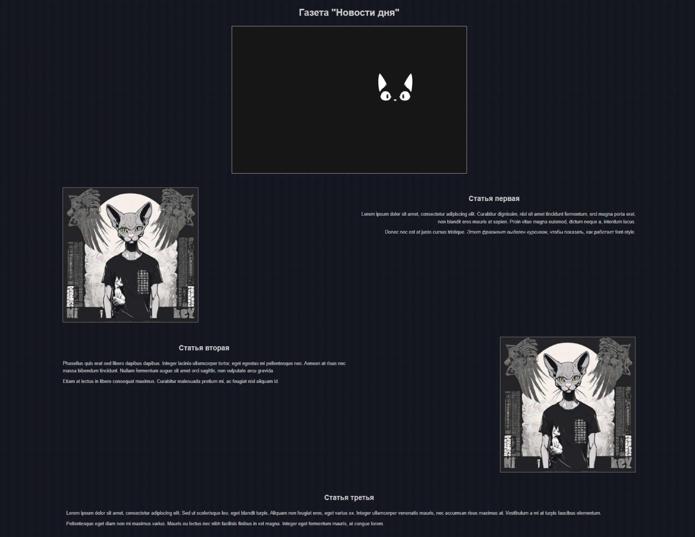

# Модуль 2. Урок 8. Работа со шрифтами и единицами измерения (px, em, rem, %, vh/vw). Google Fonts.

# Зачем нужны шрифты и какие они бывают

**Шрифт** — это не только _«красивая обложка»_ текста. От него зависит **читабельность**, **впечатление о продукте** и даже восприятие бренда. В этой вводной части мы подробно разберём:

- зачем нужны разные шрифты;
- чем отличаются системные шрифты от подключаемых (web-fonts);
- какие бывают типы шрифтов и в каких случаях их применяют;
- основные CSS-свойства для управления шрифтом (с понятными примерами).

---

## Зачем вообще нужны разные шрифты?

1. **Читабельность.** Хороший шрифт облегчает чтение — особенно при длинном тексте. Неправильно подобранный шрифт утомляет глаза и заставляет пользователя закрыть страницу раньше времени.
2. **Фирменный стиль.** Шрифт — часть визуальной идентичности. Правильный выбор (или собственный фирменный шрифт) помогает создать узнаваемость бренда.
3. **Иерархия и эмоция.** Шрифты помогают разделять заголовки и основной текст, подчёркивать важное, задавать тон (строгое — или «дружелюбное»).
4. **Адаптация под контент.** Для кода — моноширинный шрифт; для цитат — красивый курсив; для табличных данных — шрифты с чёткими цифрами.

> Вывод: шрифт — инструмент UX и дизайна, а не просто украшение.

---

## Системные шрифты vs подключаемые (web) шрифты

**Системные шрифты**

- Пример: `Arial`, `Times New Roman`, `Georgia`, `Courier New`.
- Хранятся на устройстве пользователя — не требуют загрузки.
- Плюсы: мгновенный рендер, лучшая производительность, без проблем с лицензиями.
- Минусы: ограниченный выбор, разные ОС имеют разные варианты (вёрстка может выглядеть чуть по-разному).

**Подключаемые (web) шрифты**

- Пример источника: Google Fonts, Adobe Fonts, локально подключаемые `woff/woff2`.
- Загружаются браузером при открытии страницы.
- Плюсы: большой выбор; единый внешний вид у всех пользователей; можно использовать фирменные шрифты.
- Минусы: дополнительные HTTP-запросы и вес страницы → нужно оптимизировать и выбирать минимальный набор начертаний; следить за лицензией.

**Практический совет:** используйте систему fallback-стек — сначала ваше подключённое имя, потом пару распространённых системных шрифтов, потом общий семейный тип, например:

```css
font-family: "Inter", "Helvetica Neue", Arial, sans-serif;
```

Это гарантирует, что при проблемах с загрузкой будет выбран ближайший доступный шрифт.

---

## Типы шрифтов и где их уместно использовать

Ниже — классификация по визуальному стилю и рекомендации.

### Serif (с засечками)

- Примеры: Times New Roman, Georgia, Merriweather.
- Характер: имеют «засечки» в концах штрихов.
- Когда использовать: печатные материалы, официальные сайты, заголовки в портфолио/журналах; иногда для длинного текста в печати читаются лучше.
- На экране: современные экраны читают serif хуже при очень маленьких размерах, но для крупных заголовков — часто хорошо.

### Sans-serif (без засечек)

- Примеры: Arial, Helvetica, Roboto, Inter.
- Характер: чистые, ровные формы, обычно более нейтральны.
- Когда использовать: веб-страницы, интерфейсы, тексты пассажей — чаще всего лучший выбор для основного текста в интерфейсах.

### Monospace (моноширинные)

- Примеры: Courier, Consolas, Menlo.
- Характер: все символы занимают одинаковую ширину.
- Когда использовать: код, консольные логи, таблицы с выравниванием по символам, формы с числовыми кодами.

### Cursive / Handwritten

- Примеры: Pacifico, Brush Script.
- Характер: имитируют рукописный почерк.
- Когда использовать: декоративно, в логотипах, акцентах (например, подпись), но **осторожно** — плохо читаются в длинных текстах.

### Fantasy / Display (декоративные)

- Характер: декоративные, художественные — для логотипов, плакатов, спецэффектов.
- Когда использовать: заголовки-афиши, лендинги с ярким дизайном; не для большого текста.

**Практическое правило выбора:**

- Для **основного текста** — sans-serif (на вебе чаще всего).
- Для **заголовков** — можно serif или display для создания характера.
- Для **кода** — monospace.
- Для **акцентов** — cursive/fantasy, но экономно.

---

## Основные CSS-свойства управления шрифтом

Ниже — ключевые свойства, которые нужно знать и уметь применять. Я разбираю каждое, даю краткое пояснение и практический пример.

### `font-family`

Определяет семейство шрифта (или стек). Всегда указывайте запасные шрифты и generic family (последний элемент: `serif`, `sans-serif`, `monospace`, `cursive`, `fantasy`).

```css
/* Пример: заголовки — фирменный web-шрифт, с запасными системными */
h1 {
  font-family: "Merriweather", "Times New Roman", Georgia, serif;
}

/* Общий текст — современный без засечек, с запасом */
body {
  font-family: "Inter", "Helvetica Neue", Arial, sans-serif;
}
```

**Совет:** имена, содержащие пробелы, берутся в кавычки.

---

### `font-size`

Размер шрифта. Можно задавать разными единицами (px, rem, em и т.д. — подробно про них в следующем уроке). Здесь — простая демонстрация:

```css
body {
  font-size: 16px;
} /* базовый размер */
h1 {
  font-size: 2rem;
} /* 2 × root font-size (если root 16px -> 32px) */
p {
  font-size: 1rem;
} /* умышленно равен базовому */
```

**Практика:** устанавливайте базовый размер (обычно 16px) и используйте относительные единицы для масштабируемости.

---

### `font-weight`

Контролирует «жирность» начертания. Принимает ключевые ключевые словесные значения (normal / bold) и числа от **100** до **900** (шкала по WOFF/TrueType стандарту).

- Примерное соответствие:

  - `100` — Thin
  - `200` — Extra Light
  - `300` — Light
  - `400` — Normal (regular)
  - `500` — Medium
  - `600` — SemiBold / DemiBold
  - `700` — Bold
  - `800` — ExtraBold
  - `900` — Black

```css
h1 {
  font-weight: 700;
} /* жирнее */
p {
  font-weight: 400;
} /* обычный текст */
strong {
  font-weight: 700;
} /* семантически важное */
```

**Важно:** не все шрифты содержат все веса. Если вы подключаете web-шрифт, выбирайте необходимые веса (например, 400 и 700), чтобы не грузить лишние файлы.

---

### `font-style`

Задаёт наклон начертания: `normal`, `italic`, `oblique`.

```css
em {
  font-style: italic;
}
cite {
  font-style: normal;
} /* можно отменить, если нужно */
```

- `italic` — специально подготовленное курсивное начертание (если доступно).
- `oblique` — наклон обычного шрифта (браузер генерирует наклон, если курсивного начертания нет).

---

### Пример: комбинируем свойства на практике

```html
<h1>Заголовок</h1>
<p>Параграф основного текста. <strong>Важное</strong> и <em>курсив</em>.</p>
```

```css
body {
  font-family: "Inter", Arial, sans-serif;
  font-size: 16px;
  color: #222;
}

h1 {
  font-family: "Merriweather", Georgia, serif;
  font-weight: 700;
  font-size: 2rem;
}

p {
  font-weight: 400;
  line-height: 1.6;
}

em {
  font-style: italic;
}
strong {
  font-weight: 700;
}
```

---

# Google Fonts

**Google Fonts** — это бесплатный каталог веб-шрифтов, который предоставляет:

- большой набор готовых к использованию шрифтов (семейства и начертания),
- удобный интерфейс для предварительного просмотра и выбора начертаний (веса, italic и т.д.),
- готовые фрагменты кода для встраивания (link / @import),
- возможность загрузить архив со шрифтом для локального хостинга.

Почему это удобно:

- единообразный внешний вид на всех устройствах (при подключении web-шрифта),
- простая интеграция — копируешь ссылку из интерфейса и вставляешь в `<head>`,
- неплохая производительность при разумном выборе (woff2, ограничение весов/символов).

> Важно: шрифты из Google Fonts как правило распространяются под открытыми лицензиями (SIL Open Font License и т. п.), но если вы используете другой источник — проверяйте лицензию.

---

## Как искать и подбирать шрифты на fonts.google.com — пошагово

1. **Откройте сайт** `https://fonts.google.com/`.
2. **Поле поиска**: введите имя (например, `Roboto`, `Open Sans`, `Montserrat`) или ключевое слово (например `serif`, `handwriting`).
3. **Фильтры**: сверху/слева выбирайте:

   - категорию (`Serif`, `Sans-serif`, `Display`, `Handwriting`, `Monospace`),
   - свойства (толщина/weight, ширина, italic / variable),
   - язык/набор символов (латиница, кириллица и т.д.),
   - популярность / новизна.

4. **Просмотр семейства**: кликнув по карточке шрифта, вы попадёте на страницу семейства, где:

   - видите **пример текста** (его можно заменить на собственный в поле preview),
   - есть секция **Styles** (список доступных весов: 300, 400, 700 и т.д. и отдельные italics),
   - есть секция **Customize** — где можно выбрать конкретные начертания, задавать sample text, размер предпросмотра, язык (subsets),
   - есть **Embed / Use** — готовые инструкции по встраиванию (link / @import / CSS `font-family` пример),
   - есть кнопка **Download family** — если нужно хостить шрифт локально.

**Практические советы при подборе:**

- Если нужен только основной текст и заголовки — обычно хватит **2 веса**: нормальный (400) и bold (700).
- Не выбирайте десяток весов «на пробу» — каждый вес добавляет сетевой трафик.
- В поле preview подставьте свой заголовок/текст — так вы увидите, как шрифт действительно выглядит в вашем контексте.
- Проверьте шрифт в малом размере — некоторые декоративные начертания плохо читаются в 12px.
- Если нужна поддержка кириллицы — в Customize/Language (или Subsets) включите `Cyrillic` (или `Cyrillic-ext`) — это добавит соответствующие глифы в URL (и увеличит вес).

---

## Разбор интерфейса: выбор начертаний и что означают опции

На странице семейства обратите внимание на блоки:

- **Styles**
  Здесь перечислены доступные начертания (weights и italic). Например: `Regular 400`, `Medium 500`, `Bold 700`, `Italic 400`. При клике отмечайте нужные — Google соберёт для вас URL с выбранными стилями.

- **Customize**

  - `Text` — замените примерный текст на конкретный (например, название сайта), чтобы увидеть реальное отображение.
  - `Size` — масштаб предпросмотра.
  - `Language` или `Subsets` — выбирайте наборы символов (Latin, Cyrillic, Greek и т.п.). Включение дополнительных subset’ов увеличит размер подгружаемых файлов.

- **Embed / Use**
  Здесь получите два основных куска:

  1. `<link href="...css2?family=..." rel="stylesheet">` — вставляете в `<head>`.
  2. CSS-пример `font-family: 'Family Name', sans-serif;` — применение в стилях.
     Также будет пример с `@import` (CSS) и кнопка для скачивания ZIP.

- **Download**
  Если вы планируете локально хостить шрифт — скачайте архив.

---

# Подключение шрифтов с Google Fonts — практическая разборка

Ниже — несколько сценариев: стандартный (рекомендуемый), множественные семьи, и объяснение параметров URL.

---

## 1. Рекомендованный способ — `<link>` в `<head>`

**Шаги:**

1. На странице шрифта выберите нужные веса (например, 400 и 700).
2. Перейдите в раздел **Embed** → выберите вкладку «Link». Скопируйте `<link>` и вставьте в `<head>` вашего HTML.

**Типичный пример кода (из Google Fonts):**

```html
<!-- подсказка для ускорения: preconnect (опционально, но полезно) -->
<link rel="preconnect" href="https://fonts.googleapis.com" />
<link rel="preconnect" href="https://fonts.gstatic.com" crossorigin />

<!-- основной способ подключения (копируется с сайта) -->
<link
  href="https://fonts.googleapis.com/css2?family=Roboto:wght@400;700&display=swap"
  rel="stylesheet"
/>
```

#### Разбор URL

`https://fonts.googleapis.com/css2?family=Roboto:wght@400;700&display=swap`

- `family=Roboto` — имя семейства (если имя содержит пробелы — в URL заменено на `+`, например `Open+Sans`).
- `:wght@400;700` — указание весов (у Google Fonts v2 API: `wght@` для веса). Если нужны italics/вариации, синтаксис будет сложнее (см. пример ниже).
- `&display=swap` — параметр `font-display` (объясню ниже).
- Для нескольких семейств URL содержит `&family=Montserrat:...&family=Other:...`.

#### Префикс `preconnect`

- `rel="preconnect"` к fonts.googleapis.com и fonts.gstatic.com даёт браузеру заранее установить соединение (DNS/TCP/TLS), что ускоряет загрузку шрифтов.
- Для fonts.gstatic.com нужно `crossorigin` атрибут.

**Почему `<link>` лучше, чем `@import`?**

- `<link>` загружается параллельно с другими ресурсами и не блокирует рендер так сильно, в то время как `@import` в CSS может заставить браузер сначала загрузить CSS, потом импортируемое CSS — дополнительная задержка.

---

## 2. Подключение нескольких семейств / italics / вариации

**Пример (два семейства — с весами и italic):**

```
https://fonts.googleapis.com/css2?
  family=Roboto:wght@400;700
  &family=Montserrat:ital,wght@0,400;0,700;1,400
  &display=swap
```

Пояснение:

- `Montserrat:ital,wght@0,400;0,700;1,400` — здесь для Montserrat мы запрашиваем:

  - нормальный (not italic) 400,
  - нормальный 700,
  - italic 400 (обозначено `1,400`)

- Формат `ital,wght@` — позволяет комбинировать italic и различные веса.

**Практический совет:** избегайте перечисления лишних комбинаций. Если вам нужен italic только для 400, не запрашивайте italic для всех весов.

---

## 3. Параметр `display=swap` (и другие варианты)

`display` управляет поведением шрифта до и после его загрузки — это альтернатива CSS-свойству `font-display`:

- `display=swap` — браузер сразу показывает текст системным шрифтом (fallback), затем, когда webfont загрузится, «переключается» на него (FOUT — flash of unstyled text). Это обычно рекомендовано, потому что не держит пользователя в пустом состоянии (FOIT).
- Другие варианты: `block`, `fallback`, `optional`.

  - `block` — блокировать отображение текста до загрузки (может вызвать пустую область — FOIT).
  - `fallback` — короткий блок, затем fallback;
  - `optional` — попытка загрузки, но позволить отказаться (экономить трафик).

**Рекомендация:** используйте `display=swap` для лучшего UX.

---

## 4. Предзагрузка (`preload`) — когда использовать

Если шрифт **критичный** (например, логотип/hero заголовок), можно использовать `<link rel="preload" as="font" ...>` но это требует прямого URL на файл (`fonts.gstatic.com`) и `crossorigin`. Это немного сложнее и требует точной настройки, поэтому чаще пользуются `preconnect` + `display=swap`. Preload стоит применять осторожно — он повышает приоритет загрузки и может повлиять на другие ресурсы.

---

## 5. Подключение через `@import` в CSS — как выглядит и почему не рекомендован

**Синтаксис:**

```css
/* в верхней части вашего styles.css */
@import url("https://fonts.googleapis.com/css2?family=Roboto:wght@400;700&display=swap");
```

**Почему не рекомендован:**

- `@import` внутри CSS добавляет дополнительный шаг: браузер должен сначала загрузить основной CSS, затем увидеть `@import` и только потом загрузить подключаемый ресурс. Это делает загрузку шрифтов медленнее по сравнению с `<link>` в `<head>`.
- Также `@import` может блокировать выполнение других стилей и негативно влиять на производительность критического рендера.

**Исключение:** если вы используете CSS, собираете всё в один файл и понимаете задержки, `@import` иногда удобен, но в учебных/практических проектах лучше `<link>`.

---

## 6. Как применить подключённый шрифт — `font-family` и стек

После вставки `<link>` вы можете использовать шрифт в CSS:

```css
/* пример после подключения Roboto */
body {
  font-family: "Roboto", "Helvetica Neue", Arial, sans-serif;
}

/* заголовки — другое семейство */
h1 {
  font-family: "Merriweather", Georgia, serif;
  font-weight: 700; /* только если вы загрузили 700 */
}
```

**Правила:**

- Оборачивайте имена шрифтов с пробелами в кавычки.
- В конце указывайте generic family (`sans-serif`, `serif`, `monospace`) — это запасной вариант.
- Если использовали только 400 и 700 при подключении — не просите браузер применить `font-weight: 900`, т.к. соответствующего файла нет (будет визуальное отличие).

---

## 7. Полный рабочий пример (шаг-за-шаг в HTML)

Пример: подключаем `Roboto` (400,700) и `Merriweather` (400 italic, 700) и используем их:

```html
<!DOCTYPE html>
<html lang="ru">
  <head>
    <meta charset="utf-8" />
    <meta name="viewport" content="width=device-width,initial-scale=1" />
    <title>Пример Google Fonts</title>

    <!-- ускоряем установку соединения -->
    <link rel="preconnect" href="https://fonts.googleapis.com" />
    <link rel="preconnect" href="https://fonts.gstatic.com" crossorigin />

    <!-- основной link — скопирован с Google Fonts после выбора нужных стилевых наборов -->
    <link
      href="https://fonts.googleapis.com/css2?family=Roboto:wght@400;700&family=Merriweather:ital,wght@0,400;1,400;0,700&display=swap"
      rel="stylesheet"
    />

    <style>
      body {
        font-family: "Roboto", Arial, sans-serif;
        font-size: 16px;
      }

      h1 {
        font-family: "Merriweather", Georgia, serif;
        font-weight: 700;
        font-style: normal;
      }

      em {
        font-style: italic; /* будет использоваться Merriweather italic, если указан */
      }
    </style>
  </head>
  <body>
    <h1>Заголовок — Merriweather</h1>
    <p>
      Параграф — Roboto. <em>Курсивный текст</em>.
      <strong>Жирный текст</strong>.
    </p>
  </body>
</html>
```

---

# Подключение локальных шрифтов

## 1. Как скачать шрифт с Google Fonts (ZIP-архив) — пошагово

1. Откройте сайт Google Fonts и найдите нужный шрифт (например, «Inter», «Roboto», «Merriweather»).
2. На странице семейства выберите нужные стили (weights, italics). Если вы собираетесь хостить локально — выбирайте только те веса/стили, которые реально понадобятся (чтобы не скачивать лишнего).
3. Нажмите **Download family** (обычно кнопка «Download family» или значок стрелки). Браузер скачает ZIP-архив.
4. Распакуйте ZIP — внутри вы увидите папку с файлами разных форматов (обычно `.ttf`, иногда `.woff`/`.woff2`), а также файлы с лицензией (SIL OFL или другая). **Обязательно** изучите файл лицензии, если шрифт не с Google Fonts — некоторые шрифты требуют особых условий.

> Совет: если Google отдаёт только TTF в архиве, можно преобразовать в `.woff2` с помощью инструментов (например, fontforge, sfnt2woff-zopfli, онлайн-конверторы) — но в простом учебном проекте достаточно взять те форматы, что есть. Modern best practice — иметь `.woff2` + `.woff` (fallback).

---

## 2. Структура папок в проекте — удобный и понятный вариант

Хорошо структурированный проект облегчает поддержку и быстрый поиск файлов. Рекомендую такую структуру:

```
/project-root
  /index.html
  /css
    styles.css
  /fonts
    /Inter
      Inter-Regular.woff2
      Inter-Regular.woff
      Inter-Bold.woff2
      Inter-Bold.woff
      Inter-Italic.woff2
      Inter-Italic.woff
  /images
    ...
```

Пояснения:

- Каждый шрифт — отдельная папка (здесь `Inter`).
- Имена файлов — понятные и говорящие (family-weight-style.format).
- Храните оба формата (те, которые у вас есть) — `.woff2` в приоритете, `.woff` — fallback. Можно оставить `.ttf` для старых случаев, но `.woff2`/`.woff` оптимальнее для web.

---

## 3. Форматы шрифтов: `.woff2`, `.woff`, `.ttf` (и зачем нужны web-форматы)

### .woff2

- Современный web-формат с лучшей степенью сжатия — **рекомендуется** как основной. Поддерживается современными браузерами.
- Малый размер → быстрее загрузка → лучшая производительность.

### .woff

- Старый web-формат; хорош как fallback для браузеров, не поддерживающих `.woff2` (редкие старые версии).
- Обычно ставится после `.woff2` в `src` списка `@font-face`.

### .ttf (TrueType Font)

- Формат, часто поставляемый в ZIP с шрифтами; пригоден, но **не оптимален** для web (больше весит). Иногда его оставляют для разработки или как дополнительный fallback.
- Старые IE (до 9) использовали `.eot` (Embedded OpenType) — сейчас почти не нужен.

### Итого (порядок приоритетов)

- Используйте `.woff2` как основной; затем `.woff` как fallback; `.ttf` — опционально. Это даёт лучший компромисс между совместимостью и скоростью.

---

## 4. Подключение локального шрифта через `@font-face` — синтаксис и примеры

`@font-face` создаёт правило, сообщающее браузеру: «вот шрифт на моём сервере — используй его под именем X».

Общие рекомендации при написании `@font-face`:

- Указывайте `font-family` — имя, под которым будете обращаться к шрифту в `font-family`.
- В `src` перечисляйте сначала наиболее оптимальные форматы (`woff2`), затем fallback (`woff`, `ttf`).
- Указывайте `font-weight` и `font-style` чтобы браузер мог подбирать правильное начертание при применении `font-weight` / `font-style`.
- Используйте `font-display: swap;` (или другое значение) для контроля поведения во время загрузки; `swap` — рекомендуем.

### Пример 1 — простой @font-face для одной вариации (Regular)

```css
/* файл: css/styles.css */
@font-face {
  font-family: "InterLocal";
  src: url("../fonts/Inter/Inter-Regular.woff2") format("woff2"), url("../fonts/Inter/Inter-Regular.woff")
      format("woff"), url("../fonts/Inter/Inter-Regular.ttf") format("truetype"); /* опционально */
  font-weight: 400;
  font-style: normal;
  font-display: swap;
}
```

Пояснения:

- `font-family: "InterLocal";` — это локальное имя шрифта, используемое в `font-family` позже. Можно назвать так же, как оригинальное семейство, но, чтобы избежать коллизий, часто добавляют суффикс `Local`.
- `font-display: swap;` — обеспечивает быстрый показ текста (сначала системный шрифт, затем swap на webfont после загрузки).

### Пример 2 — подключение Regular + Bold + Italic (каждый — отдельная декларация)

```css
@font-face {
  font-family: "InterLocal";
  src: url("../fonts/Inter/Inter-Regular.woff2") format("woff2"), url("../fonts/Inter/Inter-Regular.woff")
      format("woff");
  font-weight: 400;
  font-style: normal;
  font-display: swap;
}

@font-face {
  font-family: "InterLocal";
  src: url("../fonts/Inter/Inter-Bold.woff2") format("woff2"), url("../fonts/Inter/Inter-Bold.woff")
      format("woff");
  font-weight: 700;
  font-style: normal;
  font-display: swap;
}

@font-face {
  font-family: "InterLocal";
  src: url("../fonts/Inter/Inter-Italic.woff2") format("woff2"), url("../fonts/Inter/Inter-Italic.woff")
      format("woff");
  font-weight: 400;
  font-style: italic;
  font-display: swap;
}
```

Важно: для каждой комбинации (вес + стиль) нужна своя декларация. Браузер подберёт нужную, когда в CSS будет `font-weight:700` или `font-style: italic`.

### Пример 3 — использование `local()` для ускорения (опционально)

Если пользователь уже имеет такой шрифт в системе, можно первым проверить локальную версию:

```css
@font-face {
  font-family: "InterLocal";
  src: local("Inter"),
    /* если есть локальная копия, берём её */
      url("../fonts/Inter/Inter-Regular.woff2") format("woff2");
  font-weight: 400;
  font-style: normal;
  font-display: swap;
}
```

`local("Inter")` — попытка сначала использовать локально установленный шрифт. Применять осторожно: локальный шрифт может отличаться от той веб-версии, которую вы хотите.

---

## 5. Примеры: HTML + CSS — минимальный рабочий пример

**Файловая структура:**

```
/project
  index.html
  css/styles.css
  fonts/Inter/Inter-Regular.woff2
  fonts/Inter/Inter-Bold.woff2
```

**index.html**

```html
<!DOCTYPE html>
<html lang="ru">
  <head>
    <meta charset="utf-8" />
    <meta name="viewport" content="width=device-width,initial-scale=1" />
    <title>Пример локального шрифта</title>
    <link rel="stylesheet" href="css/styles.css" />
  </head>
  <body>
    <h1>Заголовок с локальным шрифтом</h1>
    <p>
      Параграф использует локально подключённый шрифт.
      <strong>Жирный текст</strong> и <em>курсив</em>.
    </p>
  </body>
</html>
```

**css/styles.css**

```css
/* Подключаем локальные файлы (пример с woff2 и woff) */
@font-face {
  font-family: "InterLocal";
  src: url("../fonts/Inter/Inter-Regular.woff2") format("woff2"), url("../fonts/Inter/Inter-Regular.woff")
      format("woff");
  font-weight: 400;
  font-style: normal;
  font-display: swap;
}

@font-face {
  font-family: "InterLocal";
  src: url("../fonts/Inter/Inter-Bold.woff2") format("woff2"), url("../fonts/Inter/Inter-Bold.woff")
      format("woff");
  font-weight: 700;
  font-style: normal;
  font-display: swap;
}

/* Теперь используем шрифт */
body {
  font-family: "InterLocal", Arial, sans-serif;
  font-size: 16px;
  color: #222;
}

h1 {
  font-weight: 700; /* браузер подберёт InterLocal 700 */
}
```

---

## 6. Предзагрузка шрифтов (preload) — когда и как

Если шрифт критичен для рендера (главный заголовок hero), можно **предзагрузить** файл шрифта, чтобы ускорить его загрузку:

```html
<link
  rel="preload"
  href="/fonts/Inter/Inter-Regular.woff2"
  as="font"
  type="font/woff2"
  crossorigin
/>
```

Пояснения и предупреждения:

- `as="font"` и `type="font/woff2"` помогают браузеру оптимизировать загрузку.
- `crossorigin` нужен, если шрифт загружается с другого домена; для локальных — обычно не требуется, но безопасно добавить, если сервер отдаёт заголовок CORS.
- **Не злоупотребляйте** preloading: каждый `preload` повышает приоритет ресурса и может помешать загрузке других критичных файлов. Используйте только для самых важных шрифтов (hero / логотип).

---

## 7. Поведение при загрузке: `font-display` и UX

`font-display` контролирует, что браузер делает с текстом до и после загрузки webfont. Значения: `auto`, `block`, `swap`, `fallback`, `optional`.

- **`swap`** — рекомендуемый вариант: сначала отображается fallback (системный) шрифт, затем когда webfont загружен — браузер переключит текст на него. Это избегает «пустого текста» (FOIT) и даёт FOUT (микроперерывание).
- **`block`** — браузер заблокирует показ текста на короткое время, ожидая шрифт (FOIT) — плохой UX.
- **`fallback`**, **`optional`** — опции для более тонкой настройки, но их поведение сложнее.

Рекомендация: в `@font-face` указывать `font-display: swap;` — и для CDN (Google) вставлять `&display=swap` в URL.

---

## 8. Производительность, кэширование и безопасность

- `.woff2` маленький → лучше.
- Поддержка HTTP/2 на сервере помогает загружать много мелких файлов быстрее.
- При локальном хостинге у вас стоит контролировать заголовки: отдавайте шрифты с правильным `Content-Type` (`font/woff2`), и при необходимости настройте `Access-Control-Allow-Origin` (если шрифты будут использоваться на других доменах).
- Кэшируйте шрифты (длительный `cache-control`), потому что шрифты редко меняются — это экономит трафик верстальщиков и пользователей.
- Если проект требует приватности (без внешних запросов) или офлайн-доступа — локальное хостинг шрифтов — правильный выбор.

---

## 9. Лицензии и юридические моменты

- Большинство шрифтов на Google Fonts распространяются под SIL Open Font License (OFL) — свободно используются, но проверьте файл LICENSE в скачанном архиве.
- Для сторонних коммерческих шрифтов — обязательно проверяйте лицензию: многие требуют покупки или ограничивают веб-хостинг.

---

## 10. Резюме: когда хостить локально, а когда — использовать Google CDN

**Google CDN (fonts.googleapis.com) — использовать если:**

- вам важна простота — копируете `<link>` и всё работает;
- вы хотите воспользоваться кэшированием у Google (шрифт может уже быть в кэше у пользователя);
- у вас нет особых ограничений по приватности/политике безопасности.

**Локальный хостинг — использовать если:**

- проект требует полной автономности (без внешних запросов), или конфиденциальности;
- вы хотите контролировать субсеты/сжать/оптимизировать шрифты под проект;
- нужно соблюдение внутренних политик компании (запрет внешних CDN);
- требуется точная версия шрифта и предсказуемое поведение.

**Практическое правило:** для учебных и небольших сайтов можно начинать с Google Fonts CDN (быстро и удобно). Для коммерческих/корпоративных проектов стоит рассмотреть локальное хостинг (особенно если есть требования по privacy/availability).

---

# Разные единицы измерения для шрифтов

Разные единицы измерения — это про **масштабируемость, наследование и контроль**.

- **Масштабируемость.** Одни единицы (px) фиксируют размер — удобно, но жёстко. Другие (rem, em) позволяют менять масштаб всей страницы, поменяв одно число.
- **Наследование.** Некоторые единицы вычисляются от родителя (em, %), другие — от корня документа (rem), третьи — от окна браузера (vw/vh). Понимание этого помогает управлять локальным и глобальным масштабом.
- **Удобство разработки.** Используя rem/em, проще строить модульную систему (кнопки, компоненты), которая корректно масштабируется при увеличении базового размера шрифта.
- **Доступность.** Использование относительных единиц (rem) помогает уважать пользовательские настройки размера в браузере.

---

## `px` — пиксели (фиксированный размер)

- Описание: абсолютная единица — указывает точное количество пикселей на экране.
- Когда удобно: когда нужен идеальный контроль над микропикселями (иконки, маленькие элементы интерфейса), либо при верстке макета по точным дизайнерским спецификациям.
- Минусы: менее гибко при изменении базового размера шрифта, не так удобно для доступности (хотя современные браузеры корректно маштабируют страницы при zoom).

**Пример:**

```css
p {
  font-size: 16px;
} /* везде будет ровно 16px */
```

---

## `em` — относительная единица (от родительского размера шрифта)

- Описание: `1em` равен computed `font-size` родительского элемента. Если у родителя 20px, то `1em = 20px` внутри ребёнка.
- Преимущества: удобно задавать размеры внутри компонента так, чтобы всё масштабировалось вместе (например, отступы кнопки, padding, размеры иконок).
- Подвох: **компаунинг (умножение)** — если вы используете несколько уровней `em`, размеры могут «нарастать» (чтобы этого избежать — внимательно считать вложенные вычисления).

**Пример (вложение вызывает эффект умножения):**

```css
.parent {
  font-size: 20px;
} /* 1em = 20px внутри parent */
.child {
  font-size: 1.5em;
} /* 1.5 * 20px = 30px */
.grand {
  font-size: 1.2em;
} /* если .grand вложен в .child, 1.2 * 30px = 36px */
```

---

## `rem` — root em (от `<html>` / корня документа)

- Описание: `1rem` равен computed `font-size` корневого элемента (`<html>`). Обычно это значение одинаково для всей страницы.
- Преимущества: сочетает гибкость и предсказуемость — все размеры привязаны к одному источнику; удобно для глобального масштаба.
- Частое использование: задают `html { font-size: 16px; }` → `1rem = 16px`, тогда все размеры легко переводятся в пиксели (2rem = 32px).

**Пример:**

```css
html {
  font-size: 16px;
} /* 1rem = 16px */
body {
  font-size: 1rem;
} /* 16px */
h1 {
  font-size: 2rem;
} /* 32px */
```

---

## `%` — процент (от родителя)

- Описание: процент для `font-size` ведёт себя как `em` — процент от размера шрифта родителя (например, `125%` = 1.25 \* parent).
- Частое применение: иногда используется для `font-size`, но чаще — для других свойств; для `line-height` часто применяют **безразмерное число** (см. ниже).
- Пример:

```css
.parent {
  font-size: 16px;
}
.child {
  font-size: 125%;
} /* 16px * 1.25 = 20px */
```

---

## `vh` и `vw` — единицы от размеров окна (viewport)

- `1vw` = 1% от ширины окна просмотра (viewport width).
- `1vh` = 1% от высоты окна просмотра (viewport height).
- Полезны для больших, выразительных заголовков, которые должны масштабироваться с шириной экрана.
- Осторожно: при очень маленькой ширине текста `vw` может делать шрифт слишком маленьким/большим → ухудшает читаемость. Для body-текста `vw` обычно **не рекомендуется**.

**Пример:**

```css
h1 {
  font-size: 5vw;
} /* на экране 1000px шириной: 5vw = 50px */
```

---

## Практические примеры и сравнения

### Пример 1 — `px` vs `rem`

```css
/* вариант A: px */
p {
  font-size: 16px;
}

/* вариант B: rem (при html { font-size: 16px; }) */
html {
  font-size: 16px;
}
p {
  font-size: 1rem;
} /* 16px */
```

Одинаковый результат при текущей настройке, но с `rem` вы можете изменить `html` и масштабнуть всю страницу.

---

### Пример 2 — `em` и эффект вложения

```html
<div class="box">
  <p class="text">Текст</p>
  <div class="nested">
    <p class="text">Вложенный текст</p>
  </div>
</div>
```

```css
.box {
  font-size: 20px;
} /* 1em внутри = 20px */
.box .text {
  font-size: 1em;
} /* 20px */
.box .nested {
  font-size: 1.2em;
} /* 1.2 * 20px = 24px */
.box .nested .text {
  font-size: 1em;
} /* 24px */
```

Итого: вложение `.nested` увеличило базовый размер — учтите это.

---

### Пример 3 — `vw` в действии

Если viewport 1200px, 1vw = 12px; тогда `h1 { font-size: 6vw; }` → 72px. Поменял размер окна — размер заголовка меняется с ним. Это удобно для эффектных масштабируемых заголовков, но не для основного текста.

---

## Когда какую единицу лучше использовать — практические рекомендации

1. **Базовая рекомендация (часто используемый подход):**

   - `html { font-size: 16px; }` (или `100%`) → затем всё задаётся в `rem`.
   - `rem` для глобальных размеров (основной текст, заголовки, отступы в layout).
   - `em` для **локального** масштабирования внутри компонентов (например, padding внутри кнопки, где всё должно масштабироваться относительно размера текста кнопки).
   - `px` — для мелких, некритичных визуальных деталей (границы 1px), иконок, если нужен абсолютный контроль.
   - `vw/vh` — для эффектных, масштабируемых заголовков (выраженные визуальные решения), но с осторожностью.

2. **Почему `html { font-size: 16px; }` часто встречается:**

   - Простота вычислений: 1rem = 16px — удобно для конвертаций между макетом и кодом.
   - Плюс: многие дизайнеры делают макеты в 16px базовом масштабе — так проще соответствовать макету.
   - Минус: жёсткая привязка к 16px может «игнорировать» пользовательские установки шрифта; более «доступный» вариант — `html { font-size: 100%; }` чтобы уважать браузерные предпочтения пользователя.

3. **Конкретные сценарии:**

   - **Текст статьи / body** — `rem` (или `px` если очень аккуратно), например `body { font-size: 1rem; line-height: 1.6; }`.
   - **Заголовки** — `rem` (например `h1 { font-size: 2.25rem; }`).
   - **Компоненты (кнопки)** — размер шрифта у кнопки можно задать в `rem` или `em`; если хочется, чтобы padding и размеры иконок внутри кнопки масштабировались вместе с шрифтом — используйте `em`.
   - **Иконки/микро-элементы** — `px` иногда проще (например, точная 16px иконка).

---

## Line-height: проценты, числа и единицы — что лучше

- Для `line-height` лучше использовать **безразмерное число**, например `line-height: 1.5;`.

  - Причина: безразмерное значение умножается на текущий `font-size` элемента и наследуется предсказуемо, не вызывает неожиданных эффектов при наследовании.

- Если вы используете проценты (`150%`) — это работает аналогично, но может путать; `px` — фиксированный, обычно не нужен для line-height.

**Рекомендация:** `p { line-height: 1.6; }` — простая и доступная практика.

---

## Наглядный «реф-образец» CSS — шаблон с рекомендациями

(этот блок можно положить в шпаргалку и возвращаться к нему)

```css
/* Рекомендуемая базовая установка */
html {
  /* либо 100% (поддержка пользовательских настроек), либо 16px для простых вычислений */
  font-size: 100%; /* = 16px обычно */
}

/* Базовый текст — используем rem */
body {
  font-family: "Inter", Arial, sans-serif;
  font-size: 1rem; /* = 16px при html=16px */
  line-height: 1.6; /* unitless — хорошая практика */
  color: #222;
}

/* Заголовки — rem для предсказуемости */
h1 {
  font-size: 2rem;
} /* = 32px */
h2 {
  font-size: 1.5rem;
} /* = 24px */

/* Компонентные размеры — em для локальной шкалы */
.button {
  font-size: 1rem; /* размер текста кнопки (от корня) */
  padding: 0.75em 1.25em; /* padding масштабируется от font-size кнопки */
}

/* Декоративный крупный заголовок — viewport-единицы (использовать осторожно) */
.hero-title {
  font-size: 6vw; /* масштабируетhся с шириной вьюпорта — для эффекта */
}
```

---

# Единицы измерения применяются повсеместно — не только к шрифтам

В CSS единицы измерения используются почти во всех свойствах: `width`, `height`, `padding`, `margin`, `border-radius`, `line-height`, `letter-spacing`, `transform`, `top/left/right/bottom`, `background-position`, `background-size`, и многих других. Поэтому понимание, как каждая единица ведёт себя (от чего зависит, как наследуется, как влияет на рендер) — это не роскошь, а базовый навык верстальщика.

Ниже — детально по единицам и примеры типичных областей применения.

---

## `px` — точечная, абсолютная единица

**Где используется чаще всего**

- Толщина бордеров: `border: 1px solid #ddd;`
- Иконки / элементы, где важен пиксельный контроль (например, мелкие UI-иконки).
- `box-shadow`, `stroke-width` для SVG, микропиксельная точность.
- Иногда — размеры изображений/контейнеров, когда нужен жёсткий контроль по дизайну.

**Плюсы**

- Точный контроль; макет будет выглядеть одинаково (в пикселях) независимо от root font-size.
- Удобно для «пиксельной» верстки по макету.

**Минусы**

- Менее гибко для масштабирования; при увеличении базового шрифта `px` не «тянется», если пользователь изменил настройки (хотя современные браузеры масштабируют при zoom).

**Примеры**

```css
.icon {
  width: 24px;
  height: 24px;
}
.card {
  border-radius: 8px;
  padding: 16px;
} /* точные отступы */
```

---

## `rem` — «root em», масштаб от `<html>`

**Где используется чаще всего**

- Базовый размер текста: `body { font-size: 1rem; }`
- Глобальные отступы/ширины/высоты блоков: `container`, `header`, `footer`.
- Размеры компонентов (кнопки, карточки), чтобы легко масштабировать весь интерфейс изменением `html { font-size }`.
- `margin` / `padding` в layout’ах, где нужна консистентность.

**Почему удобно**

- Похожи на px по предсказуемости (если задать `html { font-size }`), но дают масштабируемость: изменил одно значение — изменилось всё.
- Хорошо подходит для «типографической системы» и дизайн-систем.

**Примеры**

```css
html {
  font-size: 16px;
} /* 1rem = 16px */
h1 {
  font-size: 2.25rem;
} /* 36px */
.container {
  padding: 2rem;
} /* 32px внутренний отступ */
```

**Типичные сценарии**

- `rem` для базовых размеров и spacing в модульном дизайне.
- Любой глобальный размер — задаём `rem`, чтобы легко управлять масштабом.

---

## `em` — относительная от родителя (локальная шкала)

**Где используется чаще всего**

- Внутри компонентов: `button` padding в `em`, чтобы padding масштабировался с размером текста в кнопке.
- Для размеров шрифта внутри компонента, когда нужно «локальное» масштабирование.
- `line-height` и `letter-spacing` — иногда используют `em`, чтобы интервалы зависели от размеры шрифта.

**Особенность**

- `em` **наследуется** и **умножается** при вложении: если родитель задаёт `font-size: 20px`, то `1em` внутри — 20px. При глубокой вложенности легко получить неожиданные результаты.

**Пример**

```css
.button {
  font-size: 1rem; /* 16px */
  padding: 0.75em 1.2em; /* padding будет 0.75 * 16px = 12px по вертикали */
}
```

**Рекомендация**

- Используйте `em` для **локального масштабирования** (внутри компонента), чтобы все внутренние отступы/иконки/элементы масштабировались вместе с размером текста.

---

## `%` — относительная единица от родителя (ширина/высота, позиционирование)

**Где используется чаще всего**

- `width`/`height` для жидких сеток: `.col { width: 33%; }`
- `padding`/`margin` в процентах — процент берётся от ширины _родителя_ (для padding-блоков) — поведение иногда неожиданно.
- `background-position` или `transform` — проценты для позиционирования относительно размера элемента.

**Особенности**

- `%` часто значит «процент от размера родителя» — для ширины/высоты это очевидно; для `padding-top`/`padding-bottom` проценты рассчитываются от ширины родителя (CSS-спецификация), что удобно при создании соотношений сторон (padding-top: 56.25% — 16:9).

**Примеры**

```css
.grid {
  width: 100%;
}
.col {
  width: 33.333%;
} /* три колонки */
.ratio-box {
  padding-top: 56.25%; /* 16:9 соотношение */
}
```

---

## `vw` / `vh` — viewport-единицы (зависят от размера окна)

**Где используется чаще всего**

- Полноэкранные секции: `min-height: 100vh;` — полезно для hero-экранов.
- Крупные заголовки, которые должны масштабироваться с шириной экрана: `font-size: 6vw;`
- Для элементов, которые привязаны к видимой области (popups, модальные окна, полноэкранные фоновые блоки).

**Плюсы**

- Очень удобны для «экранной» верстки: заголовок/фон/секция покрывают всю видимую область.

**Минусы**

- На мобильных браузерах поведение `vh`/`vw` иногда отличается (адрессная/утилитная панели мобильного браузера меняют высоту viewport) — поэтому осторожно с блоками, критичными по высоте.
- Не используют для основного текстового контента — читаемость ухудшается на разной ширине.

**Примеры**

```css
.hero {
  min-height: 100vh;
}
.hero-title {
  font-size: 8vw;
} /* выразительный масштабируемый заголовок */
```

---

## Практические рекомендации

1. **Задайте базовый root**: `html { font-size: 100%; }` или `16px` → дальше используйте `rem`.
2. **Используйте `rem` для глобальных размеров** (body, заголовки, основные отступы).
3. **Используйте `em` внутри компонентов** — если хотите, чтобы padding/отступы масштабировались вместе с текстом компонента.
4. **Пиксели — для мелких деталей**: границы 1px, иконки, тени.
5. **Проценты для ширин и соотношений** — `.col { width: 33.333%; }` и `padding-top` для ratio-box.
6. **Не применяйте `vw`/`vh` к body-тексту** — это может сломать читаемость. Используйте их для больших декоративных заголовков/фонов.
7. **line-height — unitless**: `line-height: 1.5;` — наследуется корректно; не устанавливайте его в px, если хочется гибкости.
8. **Тестируйте на разных устройствах**: измените root font-size (в DevTools) — проверьте, что дизайн не ломается.
9. **Документируйте систему в дизайн-системе**: какие единицы применяются для чего (например, rem для spacing, em внутри кнопки и т.д.).
10. **Избегайте «умножающихся em-ов»** — если используете em, отслеживайте уровни вложенности.

## Примеры «реальных» кейсов (быстрое практическое руководство)

- Кнопка, которая должна менять padding вместе с размером текста:

```css
.button {
  font-size: 1rem;
  padding: 0.6em 1.2em; /* padding = умножение от font-size кнопки */
}
```

- Контейнер, который должен занимать 80% родителя:

```css
.container {
  width: 80%;
  margin: 0 auto;
}
```

- Полноэкранный герой:

```css
.hero {
  min-height: 100vh;
  padding: 6rem 1rem;
}
```

---

# Практика

## Структура проекта:

```md
project/
│ index.html
│ style.css
│
├── fonts/
│   ├── Roboto-Regular.woff2
│   ├── Roboto-Regular.ttf
│   ├── Montserrat-Bold.woff2
│   └── Montserrat-Bold.ttf
│
└── img/
    ├── hero.jpg
    ├── photo1.jpg
    ├── photo2.jpg
    └── paper-texture.jpg
```

## Шаг 1. Создать базовую HTML-разметку

1. Создайте новый проект (папку) и в ней файл `index.html`.
2. Внутри добавьте базовую структуру HTML-документа (`<!DOCTYPE html>`, `<html>`, `<head>`, `<body>`).
3. В папке проекта создайте также файл `style.css` и подключите его через тег `<link>` в `<head>`.

---

## Шаг 2. Добавить контент

Ваша страница должна напоминать газетную или журнальную статью:

- **Заголовок страницы** — например, название газеты.
- **Hero-баннер** — можно использовать картинку-заставку (например, город, природа или старую газету).
- **Статья 1**:

  - Слева картинка (например, фотография).
  - Справа текст (несколько абзацев).

- **Статья 2**:

  - Слева текст (несколько абзацев).
  - Справа картинка.

- **Статья 3**:

  - Только текст (длинный абзац, можно придумать фрагмент новости).

> 💡 Тексты можно взять «рыбой» — например, `Lorem ipsum` на несколько абзацев, чтобы получился объём.

---

## Шаг 3. Подготовить шрифты

1. Подберите два шрифта:

   - Один — для **основного текста** (например, читаемый рубленый, типа Roboto, Open Sans).
   - Второй — для **заголовков** (например, декоративный или более заметный).

2. Скачайте шрифты в формате `.ttf` или `.woff2` и положите их в папку `fonts` в проекте.
3. В `style.css` подключите их с помощью `@font-face`.

---

## Шаг 4. Настроить шрифты

1. Для всей страницы (`body`) примените шрифт для текста.
2. Для заголовков (`h1`, `h2`) примените декоративный шрифт.
3. В одном из абзацев примените **курсив**.

---

## Шаг 5. Минимальная стилизация фона

1. Найдите текстуру (например, лёгкая бумага, ткань, или нейтральный узор).
2. Сохраните её в папку `img`.
3. Установите эту текстуру как фон страницы (`background`), добавив свойство `repeat`.

---

## Шаг 6. Стилизация изображений

1. Установите для картинок ограничение по ширине (например, чтобы они не выходили за пределы контейнера).
2. Добавьте небольшие отступы, чтобы текст не прилипал к картинкам.
3. Разместите картинки с помощью `display: inline-block` и `text-align` так, чтобы в одной статье картинка была слева, а в другой — справа.

---

## Шаг 7. Выравнивание текста

1. Используйте свойства `text-align: left`, `center`, `right` для разных блоков текста.
2. Для расположения картинок и текста используйте комбинацию `inline-block` + `text-align`.

---

## Пример финальной верстки



---

# Вопросы:

1. Где обычно создаётся папка для локальных шрифтов в проекте?

   * а) `/styles/`
   * б) `/fonts/`
   * в) `/images/`

2. Какие форматы шрифтов являются оптимальными для использования в вебе?

   * а) `.woff` и `.woff2`
   * б) `.ttf` и `.otf`
   * в) `.docx` и `.pdf`

3. Какой CSS-директивой подключают локальный шрифт?

4. Для чего используется свойство `font-family`?

5. Как можно применить подключённый шрифт к заголовкам `h1` и `h2`?
   *(Напишите короткий CSS-пример)*

6. В чём разница между единицами `px` и `em`?

7. Какая единица измерения (`rem` или `em`) зависит от корневого (`html`) элемента?

8. Приведите пример, где удобно использовать `%` как единицу измерения.

9. Можно ли единицы измерения применять только к шрифтам?

   * а) Да
   * б) Нет

10. Почему единицы измерения считаются ключевым инструментом в верстке?

---

[Предыдущий урок](lesson07.md) | [Следующий урок](lesson09.md)