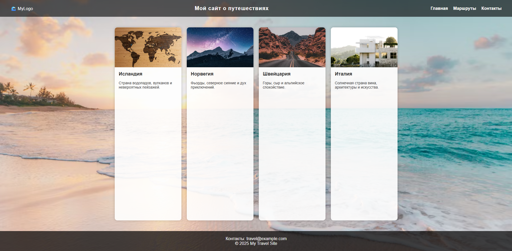

# Модуль 3. Урок 10. Введение в Flexbox

## Зачем нужен Flexbox

**Flexbox** — это инструмент для расположения **элементов внутри одного контейнера** по одной оси (горизонтальной или вертикальной). Его сильные стороны:

- **Простая и надёжная центровка** по горизонтали и вертикали.
- **Распределение свободного пространства** между элементами (равномерное заполнение, «растяжение» элементов).
- **Удобная организация строк/колонок** с переносом (`wrap`) — карточки, кнопки, элементы меню.
- **Управление порядком** отображения без изменения DOM (через `order`).
- Заменяет массу `float`/`inline-block`/`table`-хаков — код становится чище.

**Когда использовать Flexbox чаще всего:**

- горизонтальные/вертикальные навигации (menu),
- хедеры с логотипом + кнопки,
- группы кнопок и элементы управления,
- карточки товаров (внутри карточки — картинка + текст + кнопка),
- центрирование контента (например, модалки),
- layout отдельных компонентов (не всей страницы — для этого чаще используют Grid).

> Замечание: адаптивную вёрстку (медиа-запросы и брейкпойнты) мы пока **не углубляем** — упомянем её позже. Здесь — только то, что нужно понимать про Flexbox.

---

## Основные концепции и терминология

Ниже — ключевые понятия. Прочитайте, затем сразу пробуйте на примерах ниже.

### Flex container vs Flex items

- **Flex container** — элемент, к которому применили `display: flex` (или `inline-flex`). Это контейнер, внутри которого действует модель Flexbox.
- **Flex items** — непосредственные дочерние элементы контейнера. Именно они выстраиваются по правилам Flexbox.

```css
.container {
  display: flex;
} /* container */
.container > .item {
  /* это flex items */
}
```

### Main axis и Cross axis

- **Main axis (основная ось)** — направление, в котором «стреляет» поток Flex-элементов. Задаётся с помощью `flex-direction`.

  - `flex-direction: row` — main axis = горизонталь (слева направо по умолчанию).
  - `flex-direction: column` — main axis = вертикаль (сверху вниз).

- **Cross axis (поперечная ось)** — перпендикулярная main axis (если main — горизонталь, cross — вертикаль).

**Визуализация (представьте контейнер):**

```
flex-direction: row  (main → → →)
[ item1 ][ item2 ][ item3 ]
   ↑
 cross
```

```
flex-direction: column (main ↓ ↓ ↓)
[ item1 ]
[ item2 ]
[ item3 ]
   ←
 cross
```

Важно: свойства `justify-content` управляют выравниванием по **main axis**, а `align-items` — по **cross axis**.

### Shrink / Grow / Basis — смысл

Эти три понятия управляют размером flex-item'ов, когда есть или нет свободного пространства.

- `flex-grow` — как элемент **растёт**, занимая доступное свободное место. Значение 0 означает «не расти», 1 — «расти, деля пространство пропорционально».
- `flex-shrink` — как элемент **сжимается**, когда места меньше, чем нужно.
- `flex-basis` — базовый (начальный) размер элемента перед распределением оставшегося пространства. Может быть в `px`, `%` или `auto`.

Сокращённая запись: `flex: <grow> <shrink> <basis>;`
Примеры:

- `flex: 1;` эквивалентно `flex: 1 1 0%` (часто используется для равномерного заполнения).
- `flex: 0 0 200px;` — фиксированная ширина 200px (без роста и сжатия).

---

## Свойства контейнера

### 1. Свойство `display: flex` / `display: inline-flex`

Чтобы элементы внутри блока подчинялись правилам Flexbox, нужно сделать этот блок **flex-контейнером**.
Для этого используется свойство:

```css
display: flex;
```

Теперь все **прямые потомки** этого контейнера становятся **flex-элементами** и начинают выстраиваться **в одну строку** (по умолчанию).

**Важно:**

Если задать `display: inline-flex`, контейнер сам будет вести себя как **строчный элемент**, но при этом сохранять внутреннее поведение Flexbox.

**Пример:**

```html
<div class="flex-container">
  <div class="item">1</div>
  <div class="item">2</div>
  <div class="item">3</div>
</div>
```

```css
.flex-container {
  display: flex;
  border: 2px solid #4b9;
}

.item {
  background: #9cf;
  padding: 20px;
  margin: 5px;
}
```

> Элементы выстроятся **в одну строку**, равномерно по горизонтали.

---

### 2. Направление осей: `flex-direction`

Это одно из ключевых свойств Flexbox.
Оно задает **направление основной оси (main axis)**, вдоль которой располагаются элементы.

```css
flex-direction: row | row-reverse | column | column-reverse;
```

| Значение         | Направление   | Комментарий                                |
| ---------------- | ------------- | ------------------------------------------ |
| `row`            | слева направо | значение по умолчанию                      |
| `row-reverse`    | справа налево | элементы переставляются в обратном порядке |
| `column`         | сверху вниз   | ось становится вертикальной                |
| `column-reverse` | снизу вверх   | элементы располагаются снизу вверх         |

**Пример:**

```css
.flex-container {
  display: flex;
  flex-direction: column;
}
```

**Пояснение:**

Если `flex-direction: row` — основная ось горизонтальная.
Если `column` — вертикальная.
Поперечная ось (cross axis) всегда перпендикулярна основной.

---

### 3. Перенос строк: `flex-wrap`

По умолчанию все flex-элементы стараются **поместиться в одну строку**, даже если не хватает места.
Чтобы разрешить перенос — используем `flex-wrap`.

```css
flex-wrap: nowrap | wrap | wrap-reverse;
```

| Значение       | Поведение                           |
| -------------- | ----------------------------------- |
| `nowrap`       | всё в одной строке (по умолчанию)   |
| `wrap`         | перенос на следующую строку (вниз)  |
| `wrap-reverse` | перенос на следующую строку (вверх) |

**Пример:**

```css
.flex-container {
  display: flex;
  flex-wrap: wrap;
  gap: 10px;
}
```

**На практике:**
Когда у вас карточки товаров, блоки с фото или кнопки, — `flex-wrap: wrap` позволит красиво переносить их, не ломая верстку.

---

### 4. Выравнивание по основной оси: `justify-content`

Управляет **распределением свободного пространства вдоль основной оси (main axis)**.

```css
justify-content: flex-start | flex-end | center | space-between | space-around |
  space-evenly;
```

| Значение        | Что делает                                       |
| --------------- | ------------------------------------------------ |
| `flex-start`    | прижимает элементы к началу оси                  |
| `flex-end`      | прижимает к концу                                |
| `center`        | центрирует                                       |
| `space-between` | равные промежутки между элементами, края прижаты |
| `space-around`  | равные отступы вокруг каждого элемента           |
| `space-evenly`  | равные промежутки и по краям, и между элементами |

**Пример:**

```css
.flex-container {
  display: flex;
  justify-content: space-between;
}
```

---

### 5. Выравнивание по поперечной оси: `align-items`

Управляет **расположением элементов по вертикали (если `flex-direction: row`)**,
то есть — вдоль **cross axis**.

```css
align-items: stretch | flex-start | flex-end | center | baseline;
```

| Значение     | Поведение                                                |
| ------------ | -------------------------------------------------------- |
| `stretch`    | растягивает элементы по высоте контейнера (по умолчанию) |
| `flex-start` | выравнивает к верху                                      |
| `flex-end`   | выравнивает к низу                                       |
| `center`     | центрирует по вертикали                                  |
| `baseline`   | выравнивает по линии текста                              |

**Пример:**

```css
.flex-container {
  display: flex;
  align-items: center;
}
```

---

### 6. Выравнивание нескольких строк: `align-content`

Это свойство **работает только если есть перенос строк (`flex-wrap: wrap`)**.
Оно управляет распределением **групп строк** вдоль поперечной оси.

```css
align-content: flex-start | flex-end | center | space-between | space-around |
  stretch;
```

**Пример:**

```css
.flex-container {
  display: flex;
  flex-wrap: wrap;
  align-content: space-between;
  height: 400px;
}
```

**Примечание:**
Если элементов хватает на одну строку, `align-content` не влияет на внешний вид.

---

### 7. Межэлементные отступы: `gap`

Современная альтернатива `margin` между flex-элементами.
Проще, аккуратнее и безопаснее при вычислениях ширины.

```css
gap: 20px;
/* или отдельно */
column-gap: 20px;
row-gap: 10px;
```

**Пример:**

```css
.flex-container {
  display: flex;
  flex-wrap: wrap;
  gap: 15px;
}
```

---

### Пример: центрирование блока по обеим осям

Одна из самых популярных задач — **отцентрировать элемент по горизонтали и вертикали**.
С Flexbox это делается одной строкой:

```html
<div class="wrapper">
  <div class="box">Центр</div>
</div>
```

```css
.wrapper {
  display: flex;
  justify-content: center; /* по горизонтали */
  align-items: center; /* по вертикали */
  height: 300px;
  border: 2px dashed #aaa;
}

.box {
  background: #9cf;
  padding: 20px 40px;
  border-radius: 8px;
}
```

**Результат:**
Блок идеально выровнен по центру контейнера — независимо от размеров экрана или текста.

---

### Что запомнить:

- `display: flex;` делает контейнер гибким.
- `flex-direction` задает направление главной оси.
- `flex-wrap` разрешает перенос элементов.
- `justify-content` — выравнивает по основной оси.
- `align-items` — по поперечной оси.
- `align-content` — управляет расстоянием между строками.
- `gap` — задает аккуратные промежутки между элементами.

---

## Свойства элементов (flex items)

Этот раздел — практическое руководство по свойствам **flex-элементов**: как они растут, сжимаются, занимают начальный размер, меняют порядок и переопределяют выравнивание.

### Что такое flex-item (напоминание)

Flex-item — это **прямой дочерний элемент** контейнера с `display: flex` (или `inline-flex`). На него действуют правила flex-модели: он может расти/сжиматься/иметь базовый размер и т. д.

---

### `flex-grow` — как элемент растёт

`flex-grow` определяет, **насколько элемент должен увеличиться**, если в контейнере есть свободное пространство.

- Значение `0` — элемент **не будет** расти.
- Значение `1` или больше — элемент может взять долю свободного пространства. Если несколько элементов имеют `flex-grow`, пространство распределяется **пропорционально** их значениям.

**Пример**

```css
.item {
  flex-grow: 1;
} /* все элементы с flex-grow:1 поделят доступное место поровну */
.item--big {
  flex-grow: 2;
} /* этот элемент получит в 2 раза больше пространства, чем .item */
```

---

### `flex-shrink` — как элемент сжимается

`flex-shrink` управляет **возможностью элемента сжиматься**, когда места меньше, чем нужно.

- Значение `1` (по умолчанию) — элемент может уменьшаться.
- Значение `0` — элемент **не будет** сжиматься; другие элементы прижмутся или появится прокрутка.

**Пример**

```css
.item {
  flex-shrink: 1;
}
.item--fixed {
  flex-shrink: 0;
} /* сохранит свой базовый размер при недостатке места */
```

---

### `flex-basis` — начальный размер

`flex-basis` задаёт **начальный (базовый) размер** элемента перед применением `flex-grow`/`flex-shrink`. Может быть в `px`, `%`, `auto`.

- `flex-basis: auto;` — базовый размер равен содержимому или заданной ширине/высоте.
- `flex-basis: 200px;` — начнёт с 200px, затем будет расти/сжиматься.

**Пример**

```css
.item {
  flex-basis: 150px;
} /* начальная ширина 150px */
```

---

### Сокращённая запись: `flex: <grow> <shrink> <basis>`

Удобный формат для одновременной настройки:

- `flex: 1 1 0;` — расти и сжиматься, базовый размер 0.
- `flex: 0 0 200px;` — фиксированный размер 200px (не растёт, не сжимается).
- `flex: 1;` — сокращённая запись, часто воспринимаемая как `1 1 0%` (в браузерах обычно работает как `1 1 0%`).

**Примеры**

```css
/* Три элемента: центральный растягивается, боковые фиксированы */
.left {
  flex: 0 0 120px;
} /* фиксированная ширина */
.center {
  flex: 1;
} /* займет всё свободное место */
.right {
  flex: 0 0 120px;
} /* фикс. */
```

---

### `order` — менять визуальный порядок

`order` меняет **порядок отображения** элемента в flex-контейнере без изменения DOM.

- Элемент с меньшим `order` отображается раньше.
- По умолчанию `order: 0`.

**Пример**

```css
.item1 {
  order: 2;
}
.item2 {
  order: 1;
} /* отобразится раньше чем .item1, даже если в HTML .item1 идёт первым */
```

**Важно:** не используйте `order` для логики (фокус, таб-порядок, семантика). Это только визуальная перестановка.

---

### `align-self` — переопределение выравнивания

`align-self` позволяет переопределить `align-items` контейнера для **конкретного** элемента.

Значения: `auto | stretch | flex-start | flex-end | center | baseline`

**Пример**

```css
.container {
  display: flex;
  align-items: center;
}
.item-special {
  align-self: flex-start;
} /* этот элемент будет прижат к верху, игнорируя align-items */
```

---

### Практический пример: Sidebar + Content

Задача: слева — фиксированная колонка (sidebar, 220px), справа — основной контент, который заполняет оставшееся пространство.

#### HTML

```html
<div class="layout">
  <aside class="sidebar">Меню<br />Пункт 1<br />Пункт 2</aside>
  <main class="content">
    <h2>Основной контент</h2>
    <p>Здесь растягивающийся контент.</p>
  </main>
</div>
```

#### CSS

```css
.layout {
  display: flex;
  gap: 16px;
  height: 360px; /* чтобы визуально было видно растягивание */
  border: 1px solid #ddd;
  padding: 12px;
  background: #fff;
}

/* Sidebar: фиксированная ширина, не сжимается */
.sidebar {
  flex: 0 0 220px; /* flex-grow:0, flex-shrink:0, flex-basis:220px */
  background: #f0f4f8;
  padding: 12px;
  border-radius: 6px;
}

/* Content: растягивается, занимает всё оставшееся пространство */
.content {
  flex: 1 1 0; /* или просто flex: 1; */
  background: #fffefe;
  padding: 12px;
  border-radius: 6px;
  overflow: auto;
}
```

**Что здесь важно:**

- `.sidebar` не растёт и не сжимается — всегда 220px.
- `.content` заполняет всё свободное место, т.е. эластичен.

---

## Практические паттерны Flexbox

Разберём самые частые и полезные **паттерны** (готовые шаблоны решений), которые вы будете применять в реальных макетах.

### Подготовим базовую структуру

```html
<!DOCTYPE html>
<html lang="ru">
  <head>
    <meta charset="UTF-8" />
    <meta name="viewport" content="width=device-width, initial-scale=1.0" />
    <title>Flexbox Практика</title>
    <style>
      body {
        font-family: sans-serif;
        margin: 0;
        padding: 20px;
        background: #f5f5f5;
      }
      .container {
        display: flex;
        background: #fff;
        padding: 10px;
        border-radius: 10px;
        box-shadow: 0 0 10px rgba(0, 0, 0, 0.1);
        margin-bottom: 40px;
      }
      .item {
        background: #4a90e2;
        color: white;
        padding: 15px;
        border-radius: 8px;
        text-align: center;
      }
    </style>
  </head>
  <body>
    <h1>Практические паттерны Flexbox</h1>

    <!-- Примеры будут вставляться сюда -->
  </body>
</html>
```

---

### 1. Горизонтальная навигация с равномерным распределением

Одна из самых частых задач — **создать меню**, где пункты равномерно распределяются по горизонтали.
Для этого идеально подходит свойство `justify-content: space-between;`.

```html
<h2>1. Горизонтальная навигация</h2>
<div class="container" style="justify-content: space-between;">
  <div class="item">Главная</div>
  <div class="item">О нас</div>
  <div class="item">Услуги</div>
  <div class="item">Контакты</div>
</div>
```

**Как работает:**

Flexbox растягивает контейнер на всю ширину, а элементы распределяет так, чтобы первый был прижат к началу, последний — к концу, а между остальными — равные промежутки.

---

### 2. Центрирование блока внутри контейнера

Классическая задача — **отцентрировать элемент по горизонтали и вертикали**.
С Flexbox это делается в одну строку:

```html
<h2>2. Центрирование блока</h2>
<div
  class="container"
  style="justify-content: center; align-items: center; height: 200px;"
>
  <div class="item" style="width: 150px; height: 100px;">Центр</div>
</div>
```

**Комментарий:**

`justify-content` отвечает за **main axis** (горизонталь при `flex-direction: row`),
а `align-items` — за **cross axis** (вертикаль).
Комбинируя их, мы можем идеально выровнять любой элемент.

---

### 3. Сетка карточек с переносом и равномерным растяжением

Здесь Flexbox помогает создавать адаптивные **ряды карточек**, которые автоматически переносятся на следующую строку, если не помещаются.

```html
<h2>3. Сетка карточек</h2>
<div class="container" style="flex-wrap: wrap; gap: 10px;">
  <div class="item" style="flex: 1 1 200px;">Карточка 1</div>
  <div class="item" style="flex: 1 1 200px;">Карточка 2</div>
  <div class="item" style="flex: 1 1 200px;">Карточка 3</div>
  <div class="item" style="flex: 1 1 200px;">Карточка 4</div>
  <div class="item" style="flex: 1 1 200px;">Карточка 5</div>
</div>
```

**Что здесь важно:**

- `flex-wrap: wrap` — разрешает перенос элементов на новую строку.
- `flex: 1 1 200px` — каждый элемент может **расти и сжиматься**, но базовая ширина — 200px.
- `gap` — аккуратные равномерные отступы между карточками.

---

### 4. Sticky Footer (прижатый футер)

Одна из классических задач верстки — **прижать футер к низу экрана**, если контента мало.
Решается легко с помощью Flexbox и `margin-top: auto`.

```html
<h2>4. Sticky Footer</h2>

<div
  style="display: flex; flex-direction: column; min-height: 100vh; background: #fff; border-radius: 10px;"
>
  <header
    style="background: #4a90e2; color: white; padding: 20px; border-radius: 10px 10px 0 0;"
  >
    Шапка
  </header>

  <main style="flex: 1; padding: 20px;">Контент страницы</main>

  <footer
    style="background: #333; color: white; padding: 15px; margin-top: auto; border-radius: 0 0 10px 10px;"
  >
    Футер прижат к низу
  </footer>
</div>
```

**Как это работает:**

- Контейнер (`flex-direction: column`) занимает всю высоту окна.
- Основной контент (`main`) растягивается на всё свободное место.
- Футер с `margin-top: auto` уходит вниз, если место остаётся.

---

### 5. Карточка товара (фиксированная картинка + текст)

Очень частый паттерн для карточек товаров, отзывов, профилей и т.п.:
слева — фиксированное изображение, справа — растягивающийся текст.

```html
<h2>5. Карточка товара</h2>
<div class="container" style="align-items: flex-start;">
  <div class="item" style="flex: 0 0 120px; height: 120px;">🖼️ Фото</div>
  <div class="item" style="flex: 1; text-align: left;">
    <h3>Название товара</h3>
    <p>
      Описание товара. Этот блок занимает всё оставшееся место и подстраивается
      под ширину контейнера.
    </p>
  </div>
</div>
```

**Разбор:**

- `flex: 0 0 120px` — левая часть фиксирована (120px).
- `flex: 1` — правая часть растягивается, заполняя оставшееся пространство.
- Можно легко добавлять переносы, кнопки и выравнивание — всё будет гибко адаптироваться.

---

### Резюме

Flexbox позволяет быстро и просто решать десятки типовых задач:

| Задача                                 | Решение                                       |
| -------------------------------------- | --------------------------------------------- |
| Выравнивание по центру                 | `justify-content` + `align-items`             |
| Перенос карточек                       | `flex-wrap: wrap`                             |
| Прижатый футер                         | `flex-direction: column` + `margin-top: auto` |
| Растягивание блока                     | `flex: 1`                                     |
| Фиксированная колонка + гибкий контент | `flex: 0 0 Xpx` + `flex: 1`                   |

Эти приёмы составляют основу практического владения Flexbox.
Когда вы научитесь свободно применять их, любая верстка станет проще и понятнее.

---

## Самостоятельная практика

## Практика 1. Header (шапка сайта)

### Цель

Научиться выстраивать элементы в один ряд и выравнивать их с помощью Flexbox.

### Задачи

1. Создай блок `<header>` и задай ему фоновый цвет или полупрозрачный фон.
2. Внутри сделай три элемента:

   - логотип (например, текстом “MyLogo”);
   - название сайта;
   - навигацию (блок `<nav>` со ссылками — 3–4 элемента).

3. Выстрой элементы в шапке в один ряд, чтобы логотип был слева, название по центру, а навигация — справа.
4. Сделай, чтобы все элементы были вертикально выровнены по центру.
5. Для навигации также задай горизонтальное расположение ссылок с небольшими промежутками между ними.

---

## Практика 2. Main (контент сайта)

### Цель

Создать карточки с контентом и применить вертикальную компоновку внутри карточки.

### Задачи

1. Создай блок `<main>` и размести внутри него четыре карточки (`div` с классом `card`).
2. В каждой карточке должны быть:

   - блок-обложка, внутри которого находится изображение;
   - заголовок третьего уровня (название);
   - абзац с описанием.

3. Сделай так, чтобы карточки располагались в несколько рядов при нехватке места, с отступами между ними.
4. Каждая карточка должна быть белого цвета, иметь скруглённые углы и лёгкую тень.
5. Содержимое карточки должно располагаться вертикально: сверху — картинка, затем заголовок и текст.
6. Для изображений задай одинаковую высоту и ширину на всю карточку, при этом изображение должно обрезаться по краям, не растягиваясь.

---

## Практика 3. Header + Main + Footer (цельная страница)

### Цель

Объединить все части страницы и прижать футер к низу окна браузера.

### Задачи

1. Объедини созданные ранее блоки: `header` и `main`.
2. Добавь блок `footer` внизу страницы. В нём размести контактную информацию и копирайт.
3. Сделай так, чтобы футер всегда находился внизу экрана, даже если контента немного.
4. Добавь фоновое изображение для всей страницы, чтобы сайт выглядел более реалистично.
5. Проверь расположение всех элементов:

   - шапка — наверху;
   - карточки — по центру страницы, с равномерными отступами;
   - футер — прижат к низу.

---

## Рекомендации к выполнению

- Тема страницы **свободная** — выбери её сам: это может быть сайт о путешествиях, фильмах, книгах, еде, животных или хобби.
- Для фона страницы используй красивую фотографию, а для карточек — картинки по теме сайта.
- Картинки в карточках должны быть аккуратно обрезаны по размеру блока с помощью свойств, регулирующих подгонку изображения.
- Обрати внимание, чтобы шрифты, цвета и отступы выглядели гармонично.

---

### Пример готовой верстки



---

[Предыдущий урок](lesson09.md) | [Следующий урок](lesson11.md)