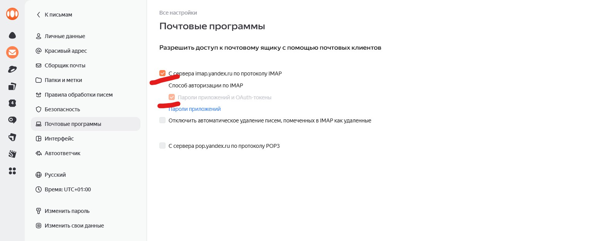

# Модуль 9. Урок 64. Настройка отправки email по SMTP в Django

## Зачем нам SMTP в проекте Cinemahub

На предыдущем уроке мы реализовали механизм восстановления пароля, используя встроенные возможности Django. Для разработки мы применяли **консольный почтовый бэкенд**, который просто выводил содержимое писем в терминал.

Однако в реальном проекте, таком как **Cinemahub**, этого недостаточно. Пользователь ожидает получить письмо:

- при восстановлении пароля;
- при регистрации (в будущем — подтверждение email);
- при важных уведомлениях (изменение данных, безопасность аккаунта).

Для этого Django должен уметь **отправлять настоящие письма через почтовый сервер**. В этом уроке мы настроим отправку email через SMTP-протокол и проверим, что восстановление пароля работает уже «по-настоящему».

---

## Что такое SMTP и как Django с ним работает

**SMTP (Simple Mail Transfer Protocol)** — это стандартный протокол отправки электронной почты. Django не отправляет письма напрямую, а:

1. формирует письмо (тема, текст, получатель);
2. подключается к SMTP-серверу;
3. аутентифицируется;
4. передаёт письмо серверу, который доставляет его адресату.

В Django за это отвечает **SMTP email backend**:

```python
django.core.mail.backends.smtp.EmailBackend
```

---

## Выбор почтового сервера для разработки

Для учебного проекта мы будем использовать **Яндекс.Почту**, так как:

- она бесплатна;
- поддерживает SMTP и SSL;
- позволяет создавать пароли приложений;
- часто используется в реальных проектах.

> Подход будет аналогичен для Gmail, Mail.ru, корпоративной почты и других SMTP-серверов.

---

## Шаг 1. Подготовка почтового аккаунта Яндекс

### Разрешение доступа для почтовых клиентов

Современные почтовые сервисы **не разрешают вход по основному паролю** из сторонних приложений. Вместо этого используются **пароли приложений**.

Перед их созданием убедимся, что доступ для почтовых клиентов разрешён:

1. Открой Яндекс.Почту.
2. Перейди в **Настройки**.
3. Найди раздел **Почтовые программы**.
4. Убедись, что доступ для почтовых клиентов включён.

Пример:



Если этот шаг пропустить, Django не сможет подключиться к SMTP-серверу.

---

## Шаг 2. Создание пароля приложения

Теперь создадим отдельный пароль, который Django будет использовать для отправки писем.

1. Перейди в Яндекс ID:
   [https://id.yandex.ru/security/app-passwords](https://id.yandex.ru/security/app-passwords)
2. Выбери тип приложения — **Почта**.
3. Укажи название, например:
   `cinemahub-django`
4. Яндекс сгенерирует пароль.

**Важно:**

- этот пароль показывается **только один раз**;
- сохрани его сразу — восстановить его нельзя, только создать новый.

---

## Шаг 3. Настройка SMTP в Django

Открой файл **`settings.py`** проекта Cinemahub и добавь настройки email.

### Базовая SMTP-конфигурация

```python
# settings.py

EMAIL_BACKEND = "django.core.mail.backends.smtp.EmailBackend"

EMAIL_HOST = "smtp.yandex.ru"
EMAIL_PORT = 465
EMAIL_USE_SSL = True

EMAIL_HOST_USER = "адрес_почты@yandex.ru"
EMAIL_HOST_PASSWORD = "пароль_приложения"

DEFAULT_FROM_EMAIL = EMAIL_HOST_USER
SERVER_EMAIL = EMAIL_HOST_USER
```

### Разбор параметров

- **EMAIL_BACKEND** — указывает Django использовать SMTP;
- **EMAIL_HOST** — SMTP-сервер Яндекса;
- **EMAIL_PORT** — порт для SSL-соединения;
- **EMAIL_USE_SSL** — включает шифрование;
- **EMAIL_HOST_USER** — email, от имени которого отправляются письма;
- **EMAIL_HOST_PASSWORD** — пароль приложения;
- **DEFAULT_FROM_EMAIL** — адрес отправителя по умолчанию.

---

## Частые ошибки на этом этапе

### ❌ Ошибка аутентификации (SMTPAuthenticationError)

Причины:

- используется **обычный пароль**, а не пароль приложения;
- опечатка в EMAIL_HOST_USER;
- неверный SMTP-хост или порт.

Решение:
проверь настройки и **создай новый пароль приложения**.

---

### ❌ Письма не приходят, но ошибок нет

Возможные причины:

- письмо попало в «Спам»;
- домен отправителя выглядит подозрительно;
- почта получателя не существует.

Для тестов используй **реальный почтовый ящик**, к которому у тебя есть доступ.

---

## Проверка отправки email через браузер

Теперь проверим всю цепочку в контексте проекта **Cinemahub**.

### Шаг 1. Открываем форму восстановления пароля

Перейди в браузере по адресу:

```
http://127.0.0.1:8000/users/password-reset/
```

### Шаг 2. Отправляем форму

- введи email пользователя, который **существует в базе**;
- нажми кнопку «Сбросить пароль».

### Шаг 3. Проверяем результат

1. Django перенаправит тебя на страницу:

   ```
   password-reset/done/
   ```

2. Открой почтовый ящик.
3. Найди письмо с темой вроде:

   ```
   Password reset on 127.0.0.1:8000
   ```

4. Перейди по ссылке из письма.
5. Установи новый пароль.
6. Попробуй войти под новым паролем.

Если все шаги выполнены успешно — **SMTP настроен корректно**.

---

## Практические задания

Повторить реализацию восстановления пароля.

---

## Вопросы

1. Зачем Django нужен SMTP-сервер?
2. Почему нельзя использовать основной пароль почты?
3. Что такое пароль приложения?
4. За что отвечает EMAIL_BACKEND?
5. В чём разница между console и smtp backend?
6. Почему важно использовать SSL?
7. Где проверять корректность работы SMTP?
8. Почему письма могут попадать в «Спам»?

---

[Предыдущий урок](lesson63.md) | [Следующий урок](lesson65.md)
