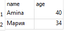

# Модуль 1 · Урок 1. Введение в базы данных и SQL

## **Цели урока:**

* понять, **зачем** нужны базы данных и чем они лучше **текстовых/Excel-файлов**;
* различать **реляционные** и **нереляционные** БД и узнаете основные типы **NoSQL**;
* узнать базовые термины: **таблица, строка, столбец, схема, ключ, связь**;
* представлять, что такое **SQL**, как он устроен (DDL/DML/…), и увидите простейшие примеры запросов.

---

## 1) Зачем нужны базы данных

### **Проблема хранения в файлах** (CSV/Excel/JSON):
сложно обеспечивать целостность и одновременную работу многих пользователей, нет транзакций, трудно быстро искать по большим объёмам, нет стандартного языка запросов.

### Решение - СУБД:
**СУБД** (система управления базами данных) решает это: даёт **индексы** для быстрого поиска, **транзакции** для надёжности, **язык SQL** для стандартных запросов и многопользовательский доступ. Для прикладных задач и прототипов часто используют **SQLite** — встраиваемую СУБД, где вся база — это **один файл** на диске. ([sqlite.org][1], [Википедия][2])

---

## 2) Реляционные vs нереляционные (NoSQL)

### Что такое реляционная модель

Реляционная модель (Э. Ф. Кодд) представляет данные в виде **отношений (таблиц)**, строки — **кортежи**, столбцы — **атрибуты**. Связи между таблицами задаются через **ключи**. Логический фундамент — предикатная логика первого порядка. ([Википедия][3])

### Куда относятся NoSQL

NoSQL («Not only SQL») — общий зонтичный термин для систем, которые **не обязаны** хранить данные в строгих таблицах со связями, а используют другие модели: **key-value**, **документную**, **колоночную (wide-column)**, **графовую** и т. п. Они чаще выбираются для горизонтального масштабирования, гибких схем и специфических задач (например, графовые обходы). ([Википедия][4])

### Сравнительная таблица

| Критерий        | Реляционные БД (SQL)                           | Документные                               | Key-Value                                 | Колоночные (wide-column)                        | Графовые                                         |
| --------------- | ---------------------------------------------- | ----------------------------------------- | ----------------------------------------- | ----------------------------------------------- | ------------------------------------------------ |
| Структура       | Таблицы (строки/столбцы), строгая схема        | Документы (JSON/BSON и пр.), гибкая схема | Пары ключ-значение                        | Семейства столбцов                              | Узлы и рёбра (граф)                              |
| Связи           | Явные (PK/FK), **JOIN**                        | Внутри документа или по id                | Нет, на уровне приложения                 | Есть, но через ключи/колонки                    | Первоклассные сущности (рёбра)                   |
| Сильные стороны | ACID, сложные запросы, отчёты, консистентность | Гибкость, удобство для вложенных структур | Максимальная простота и скорость по ключу | Распределённость, аналитика по огромным объёмам | Быстрые обходы связей, рекомендационные сценарии |
| Типичные задачи | учёт, финансы, отчётность, CRM                 | каталоги, контент, события                | кэш, сессии, фич-флаги                    | телеметрия, логирование, time-series            | соцсети, граф знаний                             |

(Детали см. во вводных статьях по NoSQL, документным и графовым БД.) ([Википедия][4])

---

## 3) Структура реляционной базы: термины «на одной странице»

| Термин                         | Коротко                                                         | Пример                                |
| ------------------------------ | --------------------------------------------------------------- | ------------------------------------- |
| **База данных**                | Набор таблиц и других объектов (представления, индексы и т. п.) | Файл `db.sqlite3` в SQLite            |
| **Схема**                      | Логическое пространство имён для объектов                       | В SQLite обычно одна «main»           |
| **Таблица (relation)**         | Структура с колонками (атрибутами) и строками (кортежами)       | `customers(id, name, phone)`          |
| **Строка (row/tuple)**         | Один объект предметной области                                  | Клиент Иванов, `id=1`                 |
| **Столбец (column/attribute)** | Свойство объекта одного типа                                    | `phone TEXT`                          |
| **Первичный ключ (PK)**        | Уникально идентифицирует строку                                 | `id INTEGER PRIMARY KEY`              |
| **Внешний ключ (FK)**          | Ссылка на PK другой таблицы                                     | `orders.customer_id → customers.id`   |
| **Индекс**                     | Структура ускорения поиска                                      | Индекс по `phone` для быстрого поиска |
| **Ограничение (constraint)**   | Правило целостности данных                                      | `UNIQUE(phone)`, `CHECK(age >= 0)`    |

Реляционная терминология и роль ключей восходят к модели Кодда. ([Википедия][3])

---

## 4) Что такое SQL (и как он устроен)

**SQL** — декларативный язык: вы говорите **что** хотите получить, а не **как** это делать пошагово. В реляционных СУБД SQL делится на несколько «подъязыков»:

| Подъязык                    | Для чего             | Примеры операторов                         |
| --------------------------- | -------------------- | ------------------------------------------ |
| **DDL** (Data Definition)   | Определение объектов | `CREATE TABLE`, `ALTER TABLE`, `DROP VIEW` |
| **DML** (Data Manipulation) | Изменение данных     | `INSERT`, `UPDATE`, `DELETE`, `MERGE`\*    |
| **DQL** (Query / Retrieval) | Чтение данных        | `SELECT`                                   |
| **DCL** (Control)           | Права доступа        | `GRANT`, `REVOKE`                          |
| **TCL** (Transactions)      | Транзакции           | `BEGIN`, `COMMIT`, `ROLLBACK`              |

*Примечание: `MERGE` поддерживается не всеми СУБД; в SQLite отсутствует. Поддержка SQL в SQLite зафиксирована в «SQL As Understood By SQLite».*

### Простейшие примеры (чтобы «почувствовать» язык)

Пусть у нас есть таблица:

```sql
CREATE TABLE customers (
  id     INTEGER PRIMARY KEY,
  name   TEXT NOT NULL,
  age    INTEGER,
  phone  TEXT UNIQUE
);
```

Как выглядит таблица:


Запросы:

```sql
-- Выбрать все строки и столбцы
SELECT * FROM customers;

-- Выбрать только имена и телефоны
SELECT name, phone FROM customers;

-- Отфильтровать по условию
SELECT * FROM customers WHERE age >= 30;

-- Упорядочить и взять первые N
SELECT name, age FROM customers ORDER BY age DESC LIMIT 5;
```

*Синтаксис и семантика `SELECT` в SQLite описаны в официальной документации.*

### Логическая «очерёдность» обработки `SELECT`

Полезно помнить логический порядок: **FROM/JOIN → WHERE → GROUP BY → HAVING → SELECT → ORDER BY → LIMIT** (физически СУБД может оптимизировать иначе, но логика чтения такая). 

*Смотри синтаксис `SELECT` и учебные материалы.*

---

## 5) Особенности SQLite (важно для всего курса)

Почему SQLite часто выбирают для обучения и встроенных приложений:

* **Встраиваемая и «серверless»**: база — это **один кроссплатформенный файл**, легко переносить, не нужен отдельный сервер. ([sqlite.org][1], [Википедия][2])
* **Динамическая типизация и «type affinity»**: в отличие от «жёстко типизированных» СУБД, SQLite привязывает тип в первую очередь к **значению**, а у столбца есть **аффинность** (предпочтительный тип хранения). Это удобная гибкость, но важно понимать последствия при сравнениях и индексах. ([sqlite.org][8])
* **Подмножество/надмножество SQL-стандарта**: SQLite поддерживает большую часть знакомого SQL, но кое-что отсутствует или реализовано иначе; подробный перечень — в «SQL As Understood By SQLite». ([sqlite.org][5])
* **Инструменты**: для ручной работы есть **CLI** (`sqlite3`), для GUI — **SQLiteStudio** (кроссплатформенная, портативная, с подсветкой синтаксиса и историей запросов). ([sqlite.org][9], [sqlitestudio.pl][10])

---

## 6) Мини-демо на одном дыхании

> Цель — увидеть «сквозной путь» от определения таблицы до запроса.

1. Создадим таблицу:

    ```sql
    CREATE TABLE customers (
    id     INTEGER PRIMARY KEY,
    name   TEXT NOT NULL,
    age    INTEGER CHECK (age >= 0),
    phone  TEXT UNIQUE
    );
    ```

    

---

2. Вставим данные:

    ```sql
    INSERT INTO customers (name, age, phone) VALUES
    ('Иван', 28, '+31-611-0001'),
    ('Мария', 34, '+31-611-0002'),
    ('Чэнь', 22, NULL),
    ('Amina', 40, '+31-611-0003');
    ```

    

---

3. Сделаем пару запросов:

    ```sql
    -- 1) У кого нет телефона?
    SELECT id, name FROM customers WHERE phone IS NULL;
    ```

    

    ```sql
    -- 2) Самые возрастные N=2
    SELECT name, age FROM customers ORDER BY age DESC LIMIT 2;
    ```

    

    ```sql
    -- 3) Сколько клиентов по возрастным сегментам?
    SELECT
    CASE
        WHEN age < 25 THEN '18–24'
        WHEN age BETWEEN 25 AND 34 THEN '25–34'
        ELSE '35+'
    END AS segment,
    COUNT(*) AS cnt
    FROM customers
    GROUP BY segment
    ORDER BY cnt DESC;
    ```

    

---

## 7) Некоторые уточнения:

* **SQL — «язык программирования»**. SQL скорее **декларативный язык запросов**: описываете желаемый результат, а план выполнения строит СУБД.
* **`NULL` «особенный»**. Это «неизвестно/нет значения», он не равен ничему, даже самому себе; для проверки используются `IS NULL`/`IS NOT NULL`.
* **«фишка» SQLite** Простота распространения (один файл), минимум настроек, достаточно возможностей для большинства учебных и встраиваемых задач. ([sqlite.org][1])

---

## 8) Вопросы для закрепления:

1. Назовите преимущества СУБД перед файлами данных.
2. Чем реляционная БД отличается от документной?
3. Дайте определения: таблица, строка, столбец, первичный ключ, внешний ключ.

---

[Следующий урок](lesson02.md)